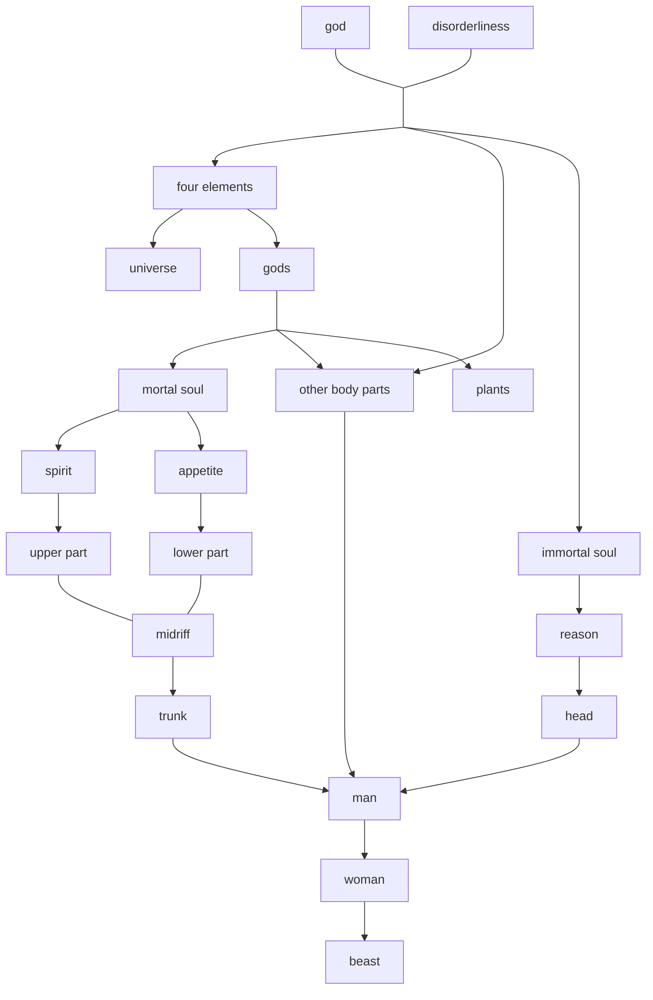

\newpage (if you set toc to false, delete this line; if not, delete this message)

## 1. Reviewing guardians in the Republic(17a-19b)
- Separation of craftsman class and the guardian class(17c)
- One person one craft(17d)
- Light on their friends, harsh on their enemy because their soul should have a nature that is at once spirited and philosophical to the highest degree(17d)
> philosophical?
- Physical and cultural training, eliminating private property and family(18a-18d)
- arrange marriage by lot, sending the bad ones to enemies(18d-19a)

## 2. The discourse on being(19b-59c)
### 2.1 Socrates' lead-in(19b-20c)
#### 2.1.1 Theme to discuss
look at them in motion(19b) /depicting our city in a contest with other cities, competing for those prizes that cities typically compete for(19c)/ present our city pursuing a war that reflects her true character(20b)

#### 2.1.2 The appropriateness of discussing the topic 
##### 2.1.2.1 Poets
- not good at anything other than imitating(19e)

##### 2.1.2.2 Sophists 
- never settle down in homes of their own(19d).

##### 2.1.2.3 Timaeus
- high birth, great property, supreme authority and honor, and mastered the entire field of philosophy

##### 2.1.2.4 Critias and Hermocrates
not layman/ well qualified to deal with these matters.

### 2.2 Critias' opening story(20c-27a)
#### 2.2.1 Origin(20e)
Solon -> Dropides(great-grandfather) -> Critias(grandfather) -> Critias

#### 2.2.2 History (21b-23e)
Yours she founded first, a thousand years before ours(23e)(9000 years from) -> the finest and best of all the races of humankind(23b)/illiterate and uncultured people(23c) -> the heavenly flood(23a) -> illiterate and uncultured infants(23b)

#### 2.2.3 Ancient laws:(24a-24d)
- the class of priests is marked off and separated from the other class
- each group works independently
- way of life that devotes to wisdom

#### 2.2.4 The accomplishment(24e-25e)
- brought to a halt in its insolent march against the whole of Europe and Asia at once

### 2.3 Timaeus' first discourse(25e-48e)

Topics: 
Timaeus: beginning with the origin of the universe, and concluding with the nature of human beings -> 
Critias: the origin of human beings and how some of them came to have a superior education

#### 2.3.1 What is that which always is and has no becoming, and what is that which becomes but never is?(28a)

being: grasped by understanding & becoming: grasped by perceiving
(a) Everything that comes to be must of necessity come to be by the agency of some cause(28a)

#### 2.3.2 Has cosmos always existed or came to be and take its start from some origin?(28b)

- Cosmos is visible and tangible and has a body, therefore it is perceptible. 
- Perceptible things are grasped by opinion, which involves sense perception.
*Therefore,*
(b) cosmos are things that come to be.

#### 2.3.3 Which of the two models did the maker use when he fashioned it? Was it the one that does not change and stays the same, or the one that has come to be?(28c)

- <mark style="background: #FFB8EBA6;">Our universe is the most beautiful and of course the craftsman is the most excellent, therefore it was the eternal model he looked at.</mark>
*Therefore,*
(c) It is necessary that this world is an image of something.(29b)

>Our universe is beautiful?
>something = Form?
>Form of the cosmos -> Image of cosmos' Form

#### 2.3.4 How it has come to be if it modeled after the changeless Form?(29b-29c)

- The accounts we give of things have the same character as the subjects they set forth. Thus what is stable and fixed and transparent to understanding are themselves stable and unshifting.(29b) Accounts we give of that which has been formed to be like that reality are themselves likely. (29c)
> ???why

##### 2.3.4.1 Why did he craftsman framed the universe?(29e-30c)
(d) God is good, and he wanted everything to become as much like himself as was possible.
>???why

(e) God took all that was visible that are in discordant motion and brought them into order.
>????why

(f) Naturally visible no unintelligent thing could as a whole be better than anything which does possess intelligence as a whole.
> ???why

(g) It is impossible for anything to come to possess intelligence apart from soul.
> How???

intelligence - soul - body

(d)-(g): likely account

#### 2.3.5 When the maker made our world, what living thing did he make it resemble?(30c-30d)
> living thing = intelligent thing?

(h) The universe resembles more closely than anything else that Living Thing of which all living things are parts, both individually and by kinds.(30c)

The world is a single visible living thing, and resembles the best of the intelligible things.(30d)

> Living Thing(Form) -> Universe(Highest living thing) -> living thing

#### 2.3.6 Have we been correct in speaking of one universe, or would it have been more correct to say that there are many, in fact infinitely many universes?(31a-31b)

- Any collection of Living Things is also Living Thing.
- Any universe resembles one Living Thing which contains most Living Thing only.
>why??

*therefore,*
(i) There is only one universe.


#### 2.3.7 The body of the world(31b-34a)
##### 2.3.7.1 Four elements(31b-32c)
- Fire: visibility
- Earth: solidity
Solids(for it has 3 dimensions) are never joined together(by friendship 32c) by just one middle term but always by two, hence the god set water and air between fire and earth.
$\frac{fire}{water} = \frac{water}{air} = \frac{air}{earth}$
>????????

##### 2.3.7.2 Why he left no part or power of any of them out?(32c-33b)

1. It should be as whole and complete as possible
2. there should be one universe
3. Disease and old age come from outside, therefore if the world is to free from disease and old age, then it should not have anything outside

##### 2.3.7.3 The shape and motion of the universe(33b-34a)
Shape: a round shape, the form of a sphere(33b). 
Motion: the one of the seven motions which is especially associated with understanding and intelligence: spinning around itself(34a)

> What does it mean by blessed god? blessed god = a being that does not requiring anything?

#### 2.3.8 The soul of the world(34b-37c)
In its center he set a soul(34b)
The god, however, gave priority and seniority to the soul(34c)

##### 2.3.8.1 The components of the soul: 
- he mixed the being with the becoming, which is a intermediate form of being, and the mixed the Same, the Different and the intermediate form of being(35a)

>why the same, the different and being? giving identity?
>
>Epistemological explanation:
>The different is in charge of the knowledge(or in Platonic sense, opinion) that contains changeable things. For example when you see a wheel, you will realize the following argument that the shape of the wheel is a circle. In this case, the Different combines two different things(being and becoming, or predicate and universal) to form a true belief. The Same combines two being, say 2 is 1+1, which is a tautology or a priori proposition. Thus, the Same allows the soul to grasp the world of Forms, and the Different allows the soul to elevate raw perception to the world of Forms.
>-->
>the Different is the movement of the Same. (i.e. the different provide the movement from form of circle to a wheel)
>movement presuppose identity
>


- slice it(35b-36b)
- fold it into 2 spinning circles, the outer movement stands for the Same and the inner movement stands for the Different.
- 7 circles in the inner one (representing zodiac).
- The corporeal body was fashioned center to center inside the soul.(36e)
- The soul is invisible, but for it shares in reason and harmony, the soul is the most excellent of all the things begotten by him.(37a)

##### 2.3.8.2 The function of the soul:
- Whenever it encounters a being, it declares what that thing is the same as, or what it is different from, and in what respect and in what manner.(37b)

#### 2.3.9 The creation of time(37d-38d)
To resemble the eternity of the model, God invented time, a *number* according to which the world remaining in unity.
> how is anything changeable or movable if there is no time?
> :: concern the form color and the realization of color red: red is perceivable therefore is things that comes to be while color is being. For red itself, it is imperfect because it does not contains the colors that are not red. Yet with time, it can change into other colors therefore make all colors united in time.

It is not accurate to say that: (38b)
- what has become to be is what has come to be
- what is coming to be is what is coming to be
- what will come to be is what will come to be
- what is not is what is not

> :: tense(was/will) does not apply to being, namely it is wrong to say the form of something was or will be so and so, whereas present tense(is) does not apply to things that come to be, which a thing that come to be only possess certain attribute in a given moment.
> :: Aristotle did not distinguish the eternal contingent things and changeless beings

He brought into being the zodiac for the begetting of time, in order to set limits to and stand guard over the numbers of time(38c)

#### 2.3.10 The living things(38e-41d)
Four kinds of living things:(40a)
1. heavenly race of gods
2. the kind that has wings and travels through the air
3. the kind lives in water
4. the kind that has feet and lives on land

##### 2.3.10.1 The nature of the visible and generated gods(38e-40d)
- The sun shines in order to bestow upon living things a share in number(time - month/year?) (39b)

Heavenly race of gods:
- fashion by the God
- made mostly out of fire, rotation and revolution bestowed (gods = fixed stars)
- The motion of the gods will bring terrors and portents of things to come to those who cannot reason.
- The task of gods: fashioning other 3 kinds of living things(41c)
- difference between zodiac and heavenly gods: the latter are everlasting and unwandering stars, the former have turnings and wander(40b)
> "because it would otherwise rival the gods(41c)", which makes the Living Thing the collection of all possible beings.

##### 2.3.10.2 Humans(41d-47e)
###### 2.3.10.2.1 Soul(41d-42d)
- made by god himself
- component: what remained of the previous ingredients, which were no longer pure(41d)
- number of souls = numbers of stars(41d)

soul -> sowed into instrument of time suitable to it
- the superior kind: man

innate capacity:(42a)
- sense perception
- love/pleasure/pain/fear/spiritedness

just life: go back to the companion star
unjust life: reincarnated as a woman, then wild animal

###### 2.3.10.2.2 Body(43a-44c)
component: 4 elements bonded by small copious rivets(43a)
sensations: the disturbance that shake the orbits of the soul when encountering external fire/water/wind/air(43c)

soul: vessel(44a) with an orbit which at first tossed by a mighty river and twisted the circle of the soul.(43a) But as the stream that brings growth and nourishment diminishes, the soul's orbits regain their composure.(44b)


###### 2.3.10.2.3 Gods’ reasons and plan(44d-47e)
a likely discussion

head(master) - body(vehicle)

**Eyes(45b-47c)**
the first of the organs to be fashioned.
vision: the coalesce of external fire and internal fire(45c)

**primary causes**: those that belong to intelligent nature. 
**secondary causes**: all those belonging to things that are moved by others and that set still others in motion by necessity.(46d)

> cause of purpose and cause of necessity, see 76e
> With the help of researching on the cause of necessity, we can therefore see the best for man(? i.e. for a pig. if we investigate the causes that make pigs fat, then we will able to have more pork; or if we know the mechanism of our body, then we know how to live a healthy life)

the supreme benefit of sight: to see stars, sun or heaven which led to the invention of number, and has given us the idea of time and opened the path to inquiry into the nature of the universe. (47b)

**Sound and hearing(47c-e)**
divine purpose: speech(47c) and musical harmony & rhythm to assist us to bring order to the orbit in our souls(47d)

### 2.4 Timaeus' second discourse(47e-59c)

Previous discourse is about things crafted by Intellect, then what is crafted by Necessity?

the world is of mixed birth: it is the offspring of a union of Necessity and Intellect. Intellect prevailed over Necessity.(48a)

How reality came to be?
Straying Cause: how it is its nature to set things adrift(48a)

How these four elements came to be?(48b)
**a restart of discourse is needed**

The new discourse:
The earlier version: changeless model and imitation of the model
The third object: receptacle of all becoming(49a)


What problem, then, do they(4 elements) present for us to work through in likely fashion? And then how and in what manner are we to go on to speak about this third kind?(49b)

```mermaid {format=png caption="The transformation of the four elements(49c)"}
graph LR;
a[water];
b[earth];
c[air];
d[fire];
a-- condense -->b;
b-- dissolve -->c;
c-- ignate -->d;
d-- extinguish -->a;
```


**The reference of "this" and "what is such"(49c-50a)**
the only thing to refer to by means of the expressions “that” and “this”: that in which they each appear to keep coming into being and from which they subsequently pass out of being(49e-50a) 

> that or this are stable designations 
> is Plato referring to material or what?

#### 2.4.1 Being, becoming and space(49c-52d)
The elements, for they are constantly turning into each other, should only be called "what is altogether such(49e)" or "what on any occasion is such and such is fire"(H. F. Cherniss trans.)

> i.e. Suppose you were molding gold into every shape there is, going on non-stop remolding one shape into the next. If someone then were to point at one of them and ask you, “What is it?,” your safest answer by far, with respect to truth, would be to say, “gold,” but never “triangle” or any of the other shapes that come to be in the gold, as though it is these, because they change even while you’re making the statement. However, that answer, too, should be satisfactory, as long as the shapes are willing to accept “what is such” as someone’s designation.(50b)

On receptacle:
The prior question: how bodies came to be, part by part, as well as the soul
The design of human body(44d-45b)
eyes and its sight
the supreme benefit of eyesight:  led to the invention of number and has given us the idea of time and opened the path to inquiry into the nature of the universe.
the god invented sight and gave it to us so that we might observe the orbits of intelligence in the universe and apply them to the revolutions of our own understanding.
> 对于古希腊人来说，日常的天气等都看起来没有规律，而视力看到的天体运动，几何形状；听觉听到的和声能够使人们意识到这个世界运行是有规律的而不是无序的，混乱的，不可预测的，换言之所有事物都有某种可预测的目的，因此我们可以合理地相信这个世界与我们的心灵都有某种内在秩序；因此心灵可以是世界秩序的原因。这一切都建立在灵魂
> 

the benefit of hearing and speech: harmony

##### 2.4.1.1 Three types of things:(50d)
1. that which comes to be(body)
2. that in which it comes to be(receptacle)
3. that after which the thing coming to be is modeled, and which is the source of its coming to be(Form)

(j) If the imprints are the be varied, then the receptacle is devoid of any those characters that it is to receive from elsewhere.(50e)
i.e. fragrant ointment, molding gold, soft materials

> Does continuity entails something unchanged?*

- The four elements are things that comes to be
therefore: 
- We shouldn't call the mother or receptacle of what has come to be, what is visible or perceivable in every other way(51a)

> what is Plato's Intelligent?

###### 2.4.1.1.1 The existence of Form
Is there a things as a Fire by itself, or the things we see and whatever else we perceive through the body are the only things that possess this kind of actuality, so that there is nothing else besides them at all and intelligible Form is nothing but mere talk?(51b-c)
If understanding and true opinion are distinct, then these “by themselves” things definitely exist—these Forms, the objects not of our sense perception, but of our understanding only.(51e)


Form: that which keeps its own form unchangingly, which has not been brought into being and is not destroyed, which neither receives into itself anything else from anywhere else, nor itself enters into anything else anywhere, is one thing.(52a)

Body: share the Form's name and resembles it(52a)

Space: provides a fixed state for all things that come to be(52a)
> why space?

###### 2.4.1.1.2 Space(52c-d)
a) Image A has come to be
b) It is not necessary that a
c) It is necessary that image A will come to be as something other than image A
【If anything stops being and it is not in something else, then it will be nothing at all】
Therefore, image A need to be in something else in order to cling to being.

#### 2.4.2 Four Elements(52e-59c)
The mechanism of space: shake the chaos into four elements(52e-53a)

##### 2.4.2.1 Two most basic shape of all shapes:(53d)
- the scalene and isosceles right-angled triangle

##### 2.4.2.2 Five elementary shapes(54e-55c)
scalene right-angled triangle:
- Primary solid form: tetrahedron 
- Second solid form: octahedron
- Third solid form: icosahedron
isosceles right-angled triangle:
- Fourth solid form: cube
The fifth solid form: dodecahedron, used for the whole universe, embroidering figures on it.

There are only one universe instead of infinite amount of them(see 2.3.6).(55c-d)

##### 2.4.2.3 Assigning shapes to the four elements(44e-56a)
Earth: cube, for earth is the most immobile and most pliable.
Fire: tetrahedron, for the fire is the most mobile.
Air: octahedron, for air is mobiler than fire but less mobile than water.
Water: icosahedron, for water is the least mobile.

```mermaid {format=png caption="The transformation of the four elements(56d-e)"}

graph LR;
a[water];
b[earth];
c[air];
d[fire];
b-- cut by water/air/fire -->b;
a-- cut by air/fire -->d & c;
c-- cut by fire -->d
d-- enveloped by water/air/earth --> c
c-- consolidate -->a

```

There are different sizes of the elementary triangles, therefore there are infinite varieties of constructions within their respective forms(57d)

##### 2.4.2.4 The preservation of motion(58b-c)
The universe allows no empty space
If any element transforms, it cause the change of its region
Therefore, the occurrence if non-uniformity is perpetually preserved.

##### 2.4.2.5 The varieties of elements(58d-59c)
Fire: flame, effluence from the flame(light), residue of flame(ember)
Air: aethor, mist, darkness...
Water: liquid, liquifiable(ice, mental...)

#### 2.4.3. The discourse on becoming(59c-92c)

##### 3.1 The combination of elements(59e-61b)
water--mixed with fire-->liquid
water--fully separated from fire/air-->hail-->ice
water--partly separated from fire/air-->snow-->frost
water--filtered by plants-->saps-->wine & oil & honey & tart juice
earth--squeezed by air-->stone
earth--expelled water-->pottery
earth-->soda & salt
earth--water-->glass & wax

##### 3.2 Capacities of the soul
###### 3.2.1 Perceptions(61e-63e)
- hot: Fire divides our bodies throughout and cut them into pieces
- cold: the moisture penetrate our body and push out smaller parts, compressing the moisture within us and congeal it by rendering it in a state of motionlessness
- hard & soft: whatever gives way to another
- heavy & light: The path towards its own kind is what makes a thing moving along it "heavy" and the region into which moves, "below", whereas the other set of terms "light" and "above"
(63e)
- smooth & rough: hardness + non-uniformity & density + uniformity

###### 3.2.2 Pleasure and pain(64a-65b)
2 parts of body: 
bones/hair: mostly earth-made parts, stop disturbance
sight/hearing: air/fire, cause chain reaction

An unnatural disturbance that comes upon us with great force and intensity is painful, while its equally intense departure, leading back to the natural state, is pleasant.(64d)
Pain: intense alienation (burns or cuts)
Pleasure: intense restoration (fragrance)

###### 3.2.3 Perception of particular parts(65c-68d)
- Tastes: involve roughness and smoothness; sweet restore the vessels of the tongue and brings pleasure(65c-66c)
- Smelling: a "half-breed" which does not consist a specific number of simple types. Can be divided into 2 types: pleasant and offensive.(66d-67a)
> why do we have many abstract concepts like sweet and bitterness for tastes but we only have fragrant and odor for smelling?
- Hearing: sound is the percussion of the air, while hearing is the percussion begins in the head and ends in where liver is situated.(67b-d)
- Sight: 
	- brightness: transparent: equal the size of the ray of sight; black: larger than and thus contracts the ray of sight; white: smaller than and thus dilates the ray of sight (67d-e)
	- color: the turmoil of fire(68a); color begins with red and other colors were mixed, whose formula is only known to the god and human can only attain a likely story.(68b-d)

### 2.5 Divine causes and necessary causes(68e-69a)
- Divine cause: for the sake of a good life to the extent that our nature allows
- Necessary cause: for the sake of divine cause, or we cannot discern the divine ones.



#### 3.4 Man(69a-76e)
Mortal soul(69c-70b)
Made by the gods:(70c-72d)
- heart: fire, contain spirit
- hung: to cool heart down
- liver: to harness the lower soul; the center of divination, which is bestowed while dreaming.
- spleen: responsible for purifying lever
- intestines: store the excess food and drink, which devoid us from gluttony and leave room for philosophy.

Made by the god(72e-76e)
- marrow: created by the god in order to bonds the soul
- bone: pure earth, quenched by fire and water in order to be insoluble by both
- sinews and flesh: allow the body to flex and protect the bones
- skin: keep brain from being insensitive while protect it
- hair: the brain punctures the skin with its fire
- nails: a mixture of sinew, skin and bone; in order to give beasts hoofs and claws.

#### 3.5 other discourse(76e-92c)
the plants
the irrigation system
harmony
aging
death
disease on body and soul
treatment on body and soul
on soul
other living things

