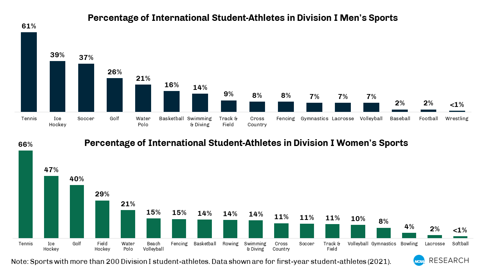

 @ncaaresearchNearlyTwothirdsDivision2023

LPGA: 

PGA Tour

PGA of America

NCAA

USGA

The R&A

August National Golf Club

The European Tour，DO World Tour

Ladies European Tour

路尚高尔夫学院
爱玩高尔夫

进钧高尔夫留学：
在大连

美国PGA高尔夫培训中心：
上海市浦东新区新金桥路15号
上海市静安区南京西路1376号上海商城东办公楼666室
上海市崇明县陈家镇揽海路55弄揽海国际高尔夫俱乐部

和大学校队教练有connection
cons：主校区似乎在崇明

CSAA SA
公司地址：上海市虹口区星荟中心1座1703

也是做体育留学的，也好像有高尔夫，但似乎不专门做高尔夫

蓝际高尔夫（和启东合作）
上海市浦东新区东启航路99号（东庄校区）
上海市闵行区虹许路555号A馆2楼A2-02号（虹桥校区）

迈克高尔夫

派格斯高尔夫

汇丰青少年
吴所谓
