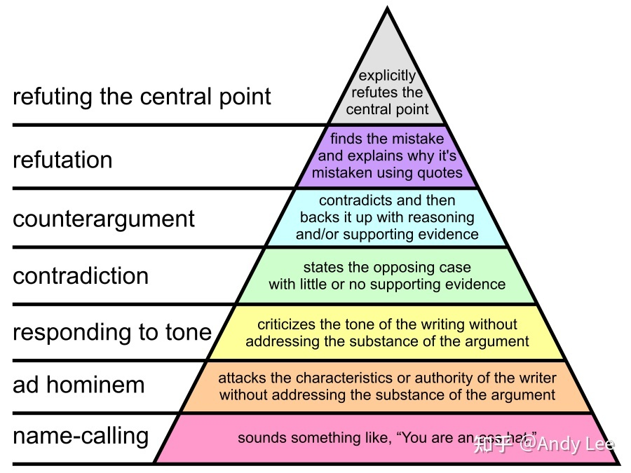

# 标化考试中的“学术”写作

## 误区A：高中议论文式“引证”

【浙江高考满分作文】生活在树上
…在尼采的观念中，如果在成为狮子与孩子之前，略去了像骆驼一样背负前人遗产的过程，那其“永远重复”洵不能成立。…

结构：通过big names让论证更有力

## 误区B：强行举例

【清北托福联盟慕课_写作讲义 2023-24】Independent Writing范例
Do you agree or disagree with the following statement? Schools (universities, colleges, and high schools) should teach students about specific careers and jobs instead of general subjects.

First, through learning a great variety of subjects, students can acquire general
knowledge across a wide range of fields. For example, I am not obsessed with all compulsory subjects, but I cherish the value of comprehensive education and study chemistry, biology, and physics diligently. Through attending multidisciplinary courses, I can develop my potential to understand the constitution of the world and the underlying principles of nature. Hence, accumulating general knowledge is part of a well-rounded education for students, even if it is not essential for job hunting.

结构： $((a \supset b) \bullet (Aa \bullet Bb)) \rightarrow (x)(Ax \supset Bx)$ ???

## “学术写作”的意涵

为什么想要更“学术”却事与愿违？什么是“学术地写作”？解释 vs. 抗辩

## 对于两个困难的回应：构建模式到回应模式

论证上的困难和举例上的困难

![[b93f953ad37557dd495b8028f5a518d.png]]

正：pension issue
反：less young people $\rightarrow$ less peer pressure in the society
good life > wealth