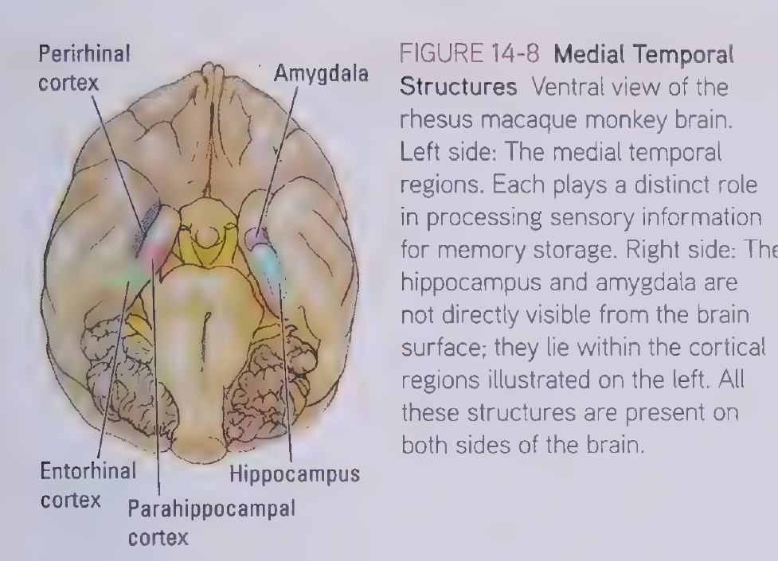
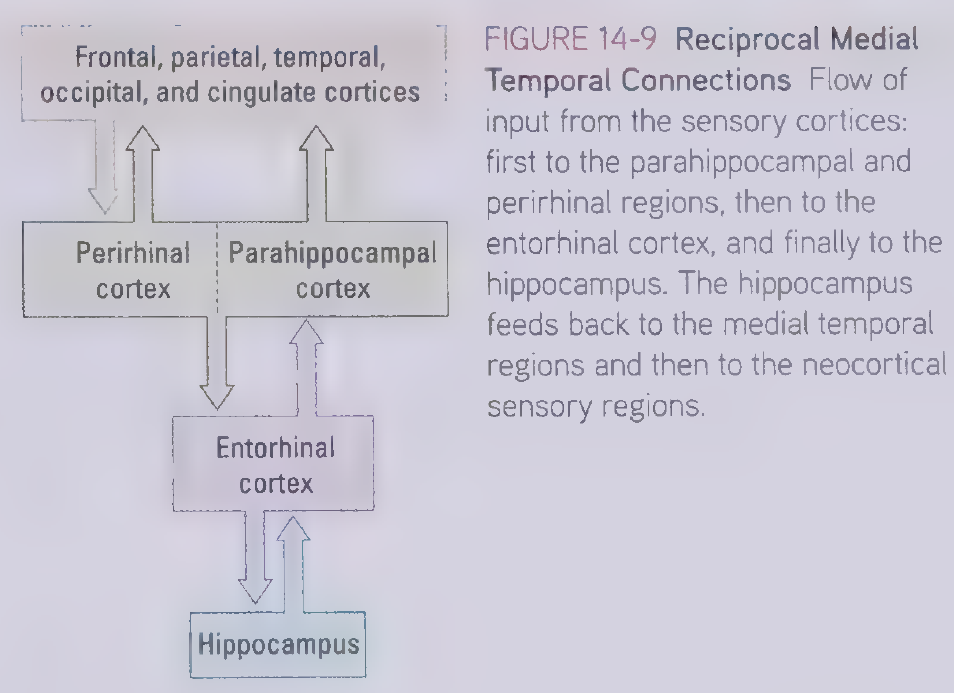
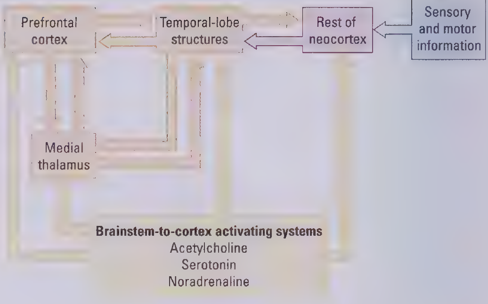
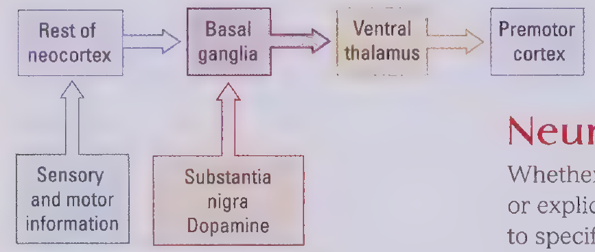
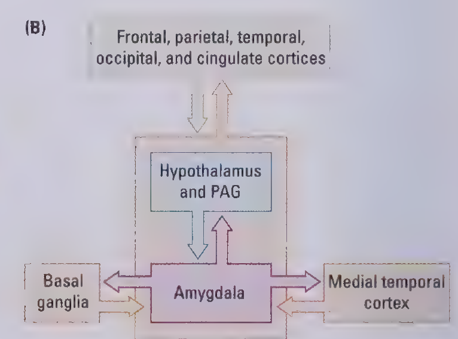

# Chapter 14

## Conditioning

### Pavlovian Conditioning

unconditioned stimulus -> unconditioned response: 
automatically triggered by cerebellum

conditioned stimulus -> emotion(i.e. fear) -> conditioned response: 
since it is emotional, different brain areas mediates the learning

### Operant Conditioning

learning the association between the actions and the consequences. Necessary circuits vary with the task requirements.

## Two categories of Memory: implicit vs. explicit

implicit: demonstrates knowledge e.g. a skill, conditioned response, or recall of events on prompting, but cannot explicitly retrieve the information. The key distinction here is whether it is conscious.

conscious recollection

people with **amnesia** has implicit memory intact but explicit memory is disconnected from implicit memory.

when applying to humans, this **implicit-explicit** dichotomy has little difference with the **declarative-procedural** dichotomy.

the conditioning mentioned above are implicit memory.

### Difference between implicit and explicit memory

#### Encoding

memories need to be encoded in order to be stored in memory. For instance:

- visual encoding: storage of visual memory, i.e. the location in a room
- semantic encoding: the storage of meaning, i.e. knowing that London is in England

Implicit Processing:

- passive, bottom-up, encoded in the same way as it is perceived.
- from receptors, through subcortical and cortical regions, ventral stream and to the temporal lobe

Explicit Processing:

- active, top-down, can be easier if initiated with by cues
- from temporal lobe forms an image, and then influence the senses (i.e. when you are finding your key, your temporal lobe forms an image of your key and affect your vision. For instance, you will ignore other objects.)

### content of Short-term vs long-term

- short-term memory: mainly in frontal lobe
  - sensory
  - motor
  - cognitive
- long-term memory: verbal mainly in temporal lobe
  - explicit
    - episodic (about yourself, i.e. your first day at school)
    - semantic (facts, i.e. SFLS is in Shanghai)
  - implicit
    - skills (i.e. riding a bike)
    - conditioning
    - priming/recall on prompting
  - emotional (both implicit and explicit)
  
#### Semantic Memory

seven regions in left-hemisphere regions: including parietal lobe, temporal lobe, prefrontal lobe, posterior cingulate cortex

This extensive network is unique to humans

#### Personal/Episodic Memory

current consensus: ventromedial prefrontal cortex (vmPFC) and hippocampus

the activities in hippocampus are similar for old and new memories, but the activity in vmPFC is stronger when the memory is older.

## Dissociating Memory Circuits

### Disconnecting Explicit Memory

Henry Molaison: after removing much of the hippocampal formation, some of the amygdala and the adjacent neocortical structure, he cannot recall anything after the surgery while his implicit memory remains intact.

### Disconnecting Implicit Memory
basal ganglia: central role in motor control && typical implicit memory is motor learning (e.g. driving, playing musical instruments or online games)

J.K. has explicit memory intact but having trouble recalling how to switch on light and turn on TV, due to Parkinson disease which primarily affects the basal ganglia.

## Neural Systems Underlying Explicit and Implicit Memories

### Explicit Memory

perirhinal cortex: visual object memory
parahippocampal cortex: visuospatial memory

the model of gateway (perirhinal & parahippocampal cortex) -> processor (entorhinal & hippocampus) ignores the extensive connection between prefrontal cortex and the hippocampus

What does hippocampus do? 
It seems to be related to **spatial memories**. For instance, cab drivers who are able to remember all the streets in London has larger posterior region of the hippocampus than the control group.

**spatial function** includes three types of cells: 

- place cell: in hippocampus, active when determining the location
- head direction cell: in hippocampus, active when determining the direction
- grid cell: in entorhinal cortex, active all the time

#### The reciprocal connections for explicit memory

The reciprocal (neocortex -> gateway -> processor -> gateway -> neocortex) connections has two benefits:

- it keeps the experience alive in the brain so that the record of an experience outlasts the actual experience
- the pathway back keep it apprised of information being processed in the medial temporal regions (can collect data from others or itself can be used by others?)

people with frontal lobe injuries are not amnestic like H.M. or J.K., but they cannot remember the time order of the events.

The basal ganglia that take part in implicit memory does not feed back to the cortex, which makes it implicit.

#### The frontal lobe and short-term memory

All sensory information are sent to the medial temporal lobe as well as the frontal lobe. Particular cells in the frontal lobe keeps firing, which persists the short-term memory. 

The new model takes prefrontal lobe and medial thalamus into consideration.

the frontal lobe is central to maintaining short-term explicit memories and memory for temporal order.

#### Consolidation of Explicit Memories

Hippocampus cannot be the storage of memories because in H.M.'s case, he can recall memories before the surgery. The neocortex is more likely to be the storage site.

It is hypothesized that hippocampus **consolidates** memories and make them permanent. Once this process is done, hippocampus is no longer needed.

##### distributed reinstatement theory 
the hippocampus replay the memories to enhance representation outside hippocampus.

**Problem:** memory can be affected. i.e. the choice of the word "smashing" and "bumping", but the distributed reinstatement theory seems to suggest that as long as a piece of memory is enhanced, it is fixed.

**Solution:** whenever a memory is replayed, it is open to further reconsolidation.

**Further problem:** decreases the likelihood of memory changes (???I don't understand)

### Implicit Memory

this is unidirectional. If memory can be consciously retrieved, the neocortical regions involved must receive feedback

### Emotional Memory

amygdala:
 -> medial temporal lobe 
 -> brain stem: control blood pressure, heart rate
 -> hypothalamus: control hormone
 -> PAG: pain perception
 -> ENS: fight or flight
 -> basal ganglia

emotional memory includes many neural system, but amygdala is critical.

## Structural basis of Brain Plasticity

### LTP

EPSP (Excitatory Postsynaptic Potentials): positive signal

IPSP (Inhabitant Postsynaptic Potentials): negative signal

LTP (Long-term potentiation): the increase in synaptic effectiveness/strength due to the increase of receptors

LTD (Long-term depression): the decrease of strength, probably for clearing out old memories

The focus on LTP and LTD are mainly on postsynaptic changes, but recent researches shows that presynaptic changes are also at work.

pulse experiment

### Modifying existing circuits

1. Formation of new synapses from new axon
2. Formation of extra synapses from already connected axon

Changes takes place mostly locally, since neuro connection between two distant neurons would be very difficult.

### Growing new neurons

Taxi drivers grow new neurons after they pass the exam.

mice with enriched experience grows new neurons, meaning that experience can not only alter existing neurons but also create new circuits.

## Sensory or Motor Training Plasticity

The training monkeys' digit motor function using small well, the proportion of digit function increases.

phantom limb remapping

