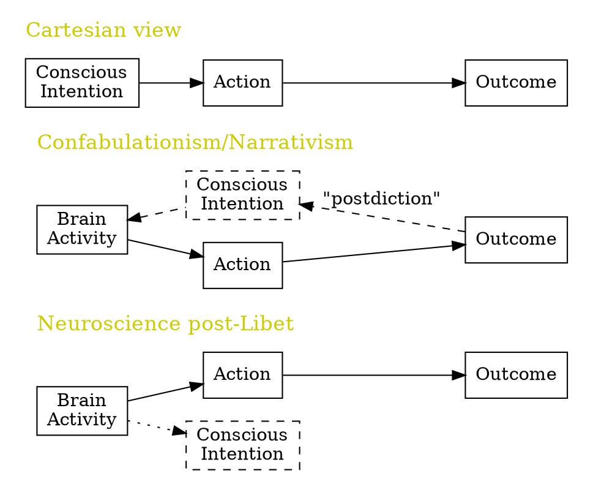

Comparator model:

If your sensory data is the same as how you predict yourself to be doing, then you have a sense of control(agency)

Problem:

1. it signals only non-agency. We have no feeling about agency (But that's fine)
2. Agency information available only post-outcome
3. We cannot perceive our own goal

Virtue:

1. There are two many info coming to our mind. Canceling predictable ones can compress the info.

> You are a determinist, you walk into a restaurant that you don't usually go to. You cannot just wait and see what happens. You have to decide what to eat. Why you have to decide? Because there is no "habit" of ordering. This is a situation that you don't have a established acting pattern. You do not automatically get a "goal," but you have to think about what is your goal.

Measurement:

1. Explicit agency judgement: Looking through a video screen, and ask: "Did you do that?"
2. Implicit measures of agency with metal chronometry: intentional binding:
	- perceptual shift: people perceive the beep earlier in timeline 2

```markdown

Intentional Binding
Haggard, Clark & Kalogeras, Nature Neuroscience, 2002

---

**Expiriment 1**:

Timeline 1:  ─────────┬──┬─────
                      │  │
               Awareness Beep
                of Beep

It beeps, report when

                   
Timeline 2:  ──┬───┬─────┬───
               │   │<─-46│
            Action │     Beep
               Awareness
                of Beep

Push the button whenever you like; report when it beeps


**Expiriment 2**:

Timeline 1:  ──┬──┬──────────
               │  │
               │   Action
            Awareness 
            of Action  

Press the button, nothing happens

Timeline 2:  ─────┬─────┬─────┬────
                  │+15->│     │
                Action  │    Beep
                   Awareness
                   of Action

Press the button, it beeps

```


is it possible that human have not evolved, or fully evolved the machenism to understand Kantian ethics?


meta-analysis is a good way to tell if an experiment is really conclusive
## Lecture 3: Prediction and Narrative in Sense of Agency

### Narrative reconstruction: "I did that"
Is agency just a reconstruction?


Daniel Dennett: Multiple drafts model

Haggard: Not the whole story. In judging whether an action is mine, if we only 

"Ambiguity of self-recognition"


### Prospective Agency in intentional Binding


### Meta-cognitive prospective agency