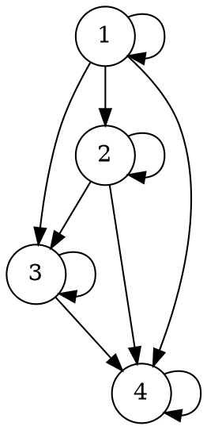

> **Problem 2.3** Show that $\equiv_n$ is an equivalence relation, for any $n \in \mathbb{N}$, and that $\mathbb{N}/_{\equiv_n}$ has exactly $n$ members.

(i) To show $\equiv_n$ is an equivalence relation, we need to show it is reflexive, symmetric and transitive.

1. *Reflexivity:* We show that $x \in \mathbb{N},x \equiv_{n} x$:

For any $x \in \mathbb{N}$, we have $x-x=0n$, Therefore,  $x \equiv_{n} x$

2. *Symmetry:* We show that for $x,y \in \mathbb{N}$, if $x \equiv_{n} y$ then $y \equiv_{n} x$:

For any $x,y \in \mathbb{N}$, if we have some $k \in \mathbb{Z}$ such that $x-y=kn$, there is also a $-k$ such that $y-x=-kn$. Therefore, if $x \equiv_{n} y$ then $y \equiv_{n} x$

3. *Transitive:* We show that for any $x,y,z \in \mathbb{N}$, if $x \equiv_{n} y$ and $x \equiv_{n} z$, then $x \equiv_{n} z$

For any $x,y,z \in \mathbb{N}$, if we have some $k_{1}, k_{2} \in \mathbb{Z}$ such that $x-y=k_{1}n$ and $y-z=k_{2}n$, then we have $x-z=x-y+y-z=(k_{1}-k_{2})n$. Since subtraction is closed on $\mathbb{Z}$, $k_{1}-k_{2} \in \mathbb{Z}$. Therefore, if $x \equiv_{n} y$ and $x \equiv_{n} z$, then $x \equiv_{n} z$

Given 1,2,3,  $\equiv_n$ is an equivalence relation.

(ii) To show that $\mathbb{N}/_{\equiv_n}$ has exactly $n$ members, we must define what does it mean for a set to have $n$ members. Unfortunately, the textbook does not provide a definition, so I have to define this myself.

**Definition:** (Informal) Suppose we have $n$ singleton sets $S_{1}, S_{2}, ..., S_{n}, n \in \mathbb{Z^{+}}$. Let $A=\bigcup_{n}S_{n}$. If members in $S_{1}, S_{2}, ..., S_{n}$ are all mutually different, then A has n elements.

**Lemma 1**: For all $a,n \in \mathbb{N}$, there is always a $k \in \mathbb{Z}, b \in \mathbb{N}$ and $b<n$ such that $a=kn+b$

We fix $n$ and induct on $a$. 

- When a=0, it is true when $k,b=0$. 
- Now assume $a=kn+b(k \in \mathbb{Z}, b \in \mathbb{N}, b<n)$, we show that there are $k' \in \mathbb{Z}, b' \in \mathbb{N}$ and $b'<n$ such that $a+1=k'n+b'$. That is, $kn+b+1=k'n+b'$. Since $b<n,$ obviously either $b+1>n$ or $b+1=n$. We analyze case by case:
	1. If $b+1<n$, then $k'=k, b'=b+1$
	2. If $b+1 = n$, then $k'=k+1, b'=0$

This closes the induction.

First we show that $\bigcup_{i < n, i \in \mathbb{N}} \{[i]_{\equiv_{n}}\}=\mathbb{N}/_{\equiv_n}$. We prove this by reductio. Assume there is a $x \in \mathbb{N}$ such that $[x]_{\equiv_{n}} \in \mathbb{N}/_{\equiv_n}$ but $x \notin \bigcup_{i < n,i \in \mathbb{N}} \{[i]_{\equiv_{n}}\}$. Thus we know for any $i < n, i \in \mathbb{N}$, there is no $k \in \mathbb{Z}$ such that $x-i=kn$. But given lemma 1 we know that there must be some $k \in \mathbb{Z}, b \in \mathbb{N}, b<n$ such that $kn+b$. Contradiction. Therefore, $\bigcup_{i < n, i \in \mathbb{N}} \{[i]_{\equiv_{n}}\}=\mathbb{N}/_{\equiv_n}$

Next we show that for any $x,y \in \mathbb{N}$ and $x,y<n$, if $x \neq y$, then $[x]_{\equiv_{n}} \neq [y]_{\equiv_{n}}$. We want to show this because we know  $1,2,...,n$ are all mutually different. If we can prove that whenever $x \neq y, [x]_{\equiv_{n}} \neq [y]_{\equiv_{n}}$, then we can show that the members of singleton sets $\{[i]_{\equiv_{n}}\}$ are also all mutually different. 

We show this by reductio. Assume $[x]_{\equiv_{n}}=[y]_{\equiv_{n}}$ and $x \neq y$. Since $\equiv_{n}$ is reflexive, $x \in [x]_{\equiv_{n}}$. Therefore $x \in [y]_{\equiv_{n}}$, $y \equiv_{n} x$. We have $y-x=kn, k \in \mathbb{Z}$. Since $y-x \neq 0$, $n,k \neq 0$. Then we have $k=\frac{y-x}{n}$. But we know $x,y \in [0,n)$, making $y-x \in (-n,n)$, $\frac{y-x}{n} \in (-1,1)$. The only integer in this range is 0, contradicts with the assumption that $x \neq y$. Therefore, if $[x]_{\equiv_{n}}=[y]_{\equiv_{n}}$ then $x=y$.

Given this, we have shown that $\mathbb{N}/_{\equiv_n}$ is the union of $n$ singleton sets the members of which are all mutually different. Therefore, $\mathbb{N}/_{\equiv_n}$ has $n$ elements.

> **Problem 2.4** If $R$ is a partial order on $A$, then $R- = R \setminus Id_{A}$ is a strict order. Moreover, if $R$ is a linear order, then $R−$ is a strict linear order.

To show $R^-$ is a strict order, we need to show it is irreflexive, transitive and asymmetric. If we need to show it is a strict linear order, we need to in addition show it is connected. 

- *Irreflexivity:* We prove $R-$ is irreflexive by reductio. 

Assume $R-$ is not irreflexive, by definition $\exists x (x \in A \land R-_{xx})$. Then there would be an instance $a$ that makes this sentence true. Then we have $a \in A \land R-_{aa}$ But $\langle a, a \rangle \in Id_{A}$, which contradicts with $R- = R \setminus Id_{A}$. Therefore, $R-$ is irreflexive.

- *Transitivity:* We show that $(R-_{xy} \land R-_{yz}) \rightarrow R-_{xz}$

Since $R-_{xy} \land R-_{yz}$, we have $R_{xy} \land R_{yz}$, and thereby $R_{xz}$, due to the transitivity of $R$. Then we need to show that $\langle x,z \rangle \notin Id_{A}$. We prove this by reductio.
Assume $\langle x,z \rangle$ in $Id_{A}$, then $x = z$. Then $Ryz = Ryx$. But $R$ is anti-symmetric and $x \neq y$. This follows that we cannot have both $Rxy$ and $Ryx$, contradiction. Therefore $\langle x,z \rangle$ is not in $Id_{A}$.

Given $R_{xz}$ and $\langle x,z \rangle \notin Id_{A}$, we have $R-_{xz}$. Since the consequent follows from the antecedent, the conditional is true. Therefore $R-$ is transitive

- *Asymmetry:* We prove $R-$ is asymmetric by reductio. 

Assume $R-$ is not asymmetric. By definition there is a pair $\langle a,b \rangle (a, b \in A)$ such that $R-_{ab} \land R-_{ba}$. We know $a \neq b$ because $\langle a,b \rangle \notin Id_{A}$. But since $\langle a, b \rangle \in R-$ and $R$ is anti-symmetric, we cannot have $R-_{ab} \land R-_{ba}$. Then the assumption is false. Therefore $R-$ is asymmetric.

- *Moreover clause: Connectivity:* We show that For any $\langle x,y \rangle \in R-$, if $x \neq y$ then $R-_{xy} \lor R-_{yx}$

For any $\langle x,y \rangle \in R-$, we always have $x \neq y$ because $\langle x,y \rangle \notin Id_{A}$. Also since $\langle x,y \rangle \in R-$, $\langle x,y \rangle \in R$. For R is connected, given $x \neq y$ we have $R_{xy} \lor R_{yx}$. Then $R-_{xy} \lor R-_{yx}$. Therefore $R-$ is connected.

> **Problem 2.5** Consider the less-than-or-equal-to relation $\leq$ on the set $\{1, 2, 3, 4\}$ as a graph and draw the corresponding diagram.

The graph $G$ is $\langle V,E \rangle$ such that $V=\{1,2,3,4\}$,  $E=\{ \langle1,1\rangle,\langle1,2\rangle,\langle1,3\rangle,\langle1,4\rangle,\langle2,2\rangle,\langle2,3\rangle,\langle2,4\rangle,\langle3,3\rangle,\langle3,4\rangle,\langle4,4\rangle \}$. The diagram is illustrated below.

> **Problem 2.6** Show that the transitive closure of $R$ is in fact transitive.
