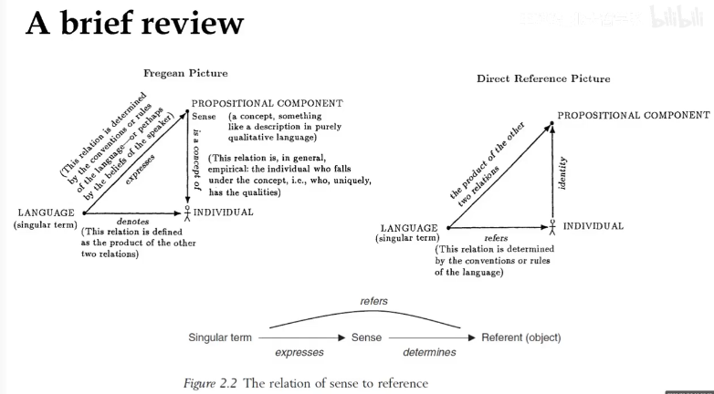
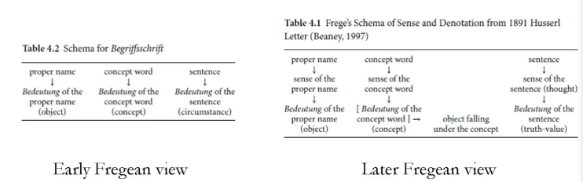

# Introduction

## 课程线索
指称问题：reference/reference
意义的决定要素：内在/外在主义
语用/语义之间的关联

## What is analytic philosophy?

Historical perplexities: 200 years ago? Frege? post-WWII?
Preston 2010, 2017: "an interpretive history","illusion of unity"

the mostly accepted way:

1. defined by philosophers
2. the sub-displinary fields
3. Williamson *Doing philosophy*

starting from common sense, clarifying terms, doing thought experiments…

## Philosophy of langauge in analytic tradition

早期分析哲学家：语言哲学的目的是为了解决别的问题（居中性地位）
e.g. 罗素取消梅农主义；

转折：晚期维特根斯坦，日常语言学派：不那么理想化

kripke：知识论（先天后天）/形而上（必然偶然）/语言（分析综合）的区分
语言本身，应用现象突显

## What is language

- symbols<->strings, sounds<->noises
- grammar/syntax/formation rules/well-formed formulas
- meaning/semantics
- linguistics uses(metaphor, satrie)/pragmatics
- language learning and acquisition
- phonetics and phenology

A language is a system of *symbols* (grammar), which *competent* speakers/users (society factors) know and use

## What is philosophy of language

### theoretical philsosophy of language

- Meaning/semantics 
- linguistics/pragmatics 
- linguistic forces/performances (to do things with words)
- normativity and rules (Witgenstein)

### applied philosophy of language

- on ideology and propoganda
- on bullshit

## Various "triangle" in philosophy

language -- speakers -- world Blackburn(1984), p1

- language -- speakers: theory of meaning
- speakers -- world: theory of knowledge
- world -- language: theory of truth

the direction of arrow depends on how you understand

## Two crucial distinctions/terminologies

### type/token distinction

token: the type-token distinction was introduced by Perice. This is a distinction between sorts of things (types) and their instances (tokens). The sentence "The cat is on the mat" consists of six word tokens and five word types (because it includes two tokens of the type 'the') (Tanesini 2007, 164)

> not universal-particular distinction in metaphysics because token can still be universal?

### use/mention distinction

use: normal use of language
eg. Milan is a city

mention: quote
Eg. **"Milan"** has five letters

### sentence, proposition and utterance

sentence: a string
proposition: the content of a sentence
utterance/assertion/question: an action of a subject, with spacial and temporal information

- a sentence: a physical sequence in a linguistic system
- statement/assertion/utterance: a human action performed in certain place at certain time
  - assertion: belief (denote cognitive state)
  - utterance: conversation (can be denied)
- proposition: an abstract meaning entity *expressed by a sentence or a statement*, universally applies to all languages
  - Popper: "the third realm"
  - Plato: "Form"

# Meaning

## The pervasive "meaning"

- linguistic meaning
- individualized meaning
- the meaning of life
- the meaning of a clock represents time (stands for)

the problem of "meaning":
Where does meaning come from?

## meaning and understanding:

**observations:**

some false statement also has meaning

- we understand a sentence when we don't know if it is true
- some strings marks or noises are meaningful sentences
- each meaningful sentence has parts that are themselves meaningful
- each meaningful sentence means something in particular
- competent speakers of a language are able to understand (and produce) many of that language's sentences, without effort and almost instantaneously

**to distinguish:**

- truth value
- truth condition
- falsification of a statement (philosophy of language does not care too much about it)

to understand a sentence is to understand its truth condition

## Referential Theory

linguistic expressions have the meanings they do because they **stand for** things.
on this view, words are like labels

- **thing theory of meaning**: meaning comes from physical object, the common-sensical view
- **idea theory of meaning**: meaning comes from ideas, from Locke, impressions vs. ideas; this is how it comes into existence; *Problem: how do we learn other people's idea?*
- **use theory of meaning**: meaning comes from use, from Frege: if words are used in the ordinary way, what one *intends* to speak of is their reference.

Frege's puzzle: the co-reference of two proper names(two words has the same reference, i.e. Hesperus is Phosphorus)

Objections against the referential theory of meaning:
the universality of the referential theory of meaning: apply to all/almost?

- some counterexample: nothing, non-existence
- how do we form "this+glass" when we see a glass?
- what are the differences between adverb, none, ...?

# Frege

## Frege's important works:

- (1891) "Function and Concept"
- (1892) "on Sense and Reference"
- (1892) "Concept and Object"
- (1904) "What is a Function?"
- (1918) "Thought"

Frege's System of Begriffsschrift("语形")
if B, then A
Modern: B → A 
Frege: "-": content stroke "|": assertion stroke
|--A
 |-B

Frege's logical reductionism: all mathematical truth are logical truth

- **the principle of compositionality**: meaning comes from recursive formation of components
- **the context principle**: the meaning of a word depends on the context (but what is context? how broad it is? Frege: sentence)

## On Sense and Reference (Uber Sinn und Bedeutung)

### Background: Identity in Logic

identity sign '=': binary relational sign/operator

- difference between identity statements and bi-conditionals
- the need of identity in logic
- the need of identity in mathematics
- some important principles in philosophy:
  - the indiscernibilty of identical, Leibnitz law

### The introduction of the puzzle:

| a=a                  | a=b                    |
| -------------------- | ---------------------- |
| uninformative        | informative            |
| with cognitive value | no (significant) value |
| a priori             | a posteriori           |

the distinction of sense and reference of a sign

criticism: not semantic, but cognitive difference

弗雷格：概念文字时期有尝试性的解决方案：元语言

John Perry: Frege's Detour
重新解释弗雷格，不引入sense，依然用概念文字的思路

### Identity/quality is a relation between names or signs of objects

"A difference can arise only if the difference between the signs corresponds to a difference in **the mode of presentation** of that which is designated"

John Perry on "**mode of presentation**"
关于内涵的函数性操作 functions in intension

### A general theory of sense and reference:

sense vs. reference
an easily neglected layer of words, easy to have a full understanding vs. the target of words, hard/impossible to have a full understanding.

Frege's problem: dismiss problems with natural language at hand

# Russell

1872 - 1970

## On Descriptions

**Recall:**

Frege: proper name是一个广义概念，只要specify一个特定的object就可以算作proper name（a proposition is also a proper name, since it also denotes one definite object, which is the truth-value）

**现代细分：**

singular term (particular) vs general term (universal);

singular terms include (instinctive, informal):

- proper names (Scott)
- definite description (the queen of England)
- singular pronouns (you)
- demonstrative pronouns (this)
- complex singular demonstratives (this table)

### The taxonomy of "descriptions":

**definite vs. indefinite/ambiguous**
e.g. the man vs. a man

some exceptions:
definite WITHOUT the
his book -> the book of him
John's computer -> the computer of John

NOT definite description WITH the:
the Holy Roman Empire (neither holy, nor Roman, nor empire)

**A methodological preference:**
rejection of unreal objects
the unreal objects has a sense, but it is not to say it is an object

p.s. "always","sometimes" -> not temporal description, just a quantifier

indefinite:
an object having the property F has the property G = the intersection of Fx and Gx is not empty

definite:
indefinite expression + uniqueness

- at least one thing is F
- at most one thing is F
- whoever F is G

> 自然语言优先，用逻辑符号是工具性的选择而不是第一性的
> 日常专名是否是限定性描述？（因为我们想到同一个专名的时候想到的东西是不一样的）
> 自然语言是否需要把思想差异带入？（在语义层面解释还是在个题思想层面解释？）

Scott is Sir Walter: the person named "Scott" is the person named "Sir Walter"

> 罗素这里还是先承认了日常专名，然后“用作”description；日常专名并不是description

**Methodological implication**

The semantic/logical analysis may not correspond with grammatical/synatical form

**Russell's solutions to the problems:**

- Reference to nonexistents
- Negative exsistentials: "the F does not exist" when there is no such F, this sentence is true and meaningful

> "exist" is not a predicate; and the problem is when there are more than one F, the sentence will also be true

- the Problem of the excluded middle: "The F is G" vs "The F is not G" are not contradictory to each other because the *scope* of negation is different
  - "the primary occurrence vs. secondary occurrence", "The *de re* reading vs. the *de dicto* reading"
  - Russell's dichotomy cannot Handel multiple negations. Therefore it is better to describe it with scope.

### Proper names and disguised/abbreviated definite description

**Frege: This should not happen**

- Aristotle = the teacher of Alexander = the pupil of Plato
- Frege does not concern this much because he thinks a perfect language should avoid this phenomenon

**Russell: Use proper name as description, but still there are still proper names**

- When we ask whether Homer existed, we are *using* the word 'Homer' *as* an abbreviated description
- The same consideration apply to almost all *uses* of what look like proper names

This name claim is independent of the theory of description itself

**Kemp:** The language user understand 'a' as a synonymous for "the F"

### Knowledge by acquaintance and knowledge by description

can be the logical distinction for different proper names

items can be acquainted with

- sense-data
- universals (i.e. color)
- the self (consciousness/pain/emotion)

principle of acquaintance:

- any proposition we can understand must be composed by entirely of entites with wich we are acquainted.

we cannot acquaint with "table"/"tree" itself. Thus we cannot understand **atomic** proposition about tables and trees. But then how do we talk about tables and trees?

Russell: when we say table, we talk about the table via sense data. 

*The table is brown* is in fact The external cause of THIS (**table-shaped batch of sense-data**) is cluttered. Therefore, the table is only "denoted`described by sense`" in Russell's sense. (Kemp 58-59)

> table-shaped?

Russell's epistemology is empiricist.

The common factor in Frege's view and Russell's view: the same reference with different sense

## On denoting

earlier work

**Frege:** dual-layer theory: sense and reference

when words are used in oridinary way, one intend to speak of their reference

**Russell:** Does all phrase has sense/reference dichotomy?

C: C's denotation

'C': C's meaning

Problem: How does the meaning denotes the denotation?

Requirement: sense and reference have connection and not the same
