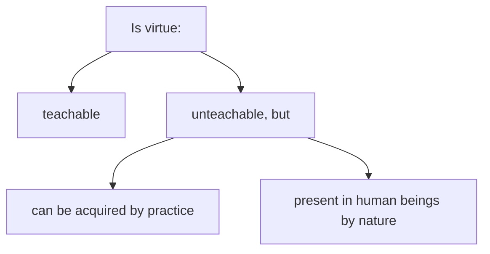

# 1. The Testing of Meno’s Knowledge (70a-80e)
## 1.1 Setting up the Question (70a-71e)
### 1.1.1 Is virtue teachable? (70a)

### 1.1.2 The Priority of Definition & Socrates’ Disavowal (70a-71c)
Socrates' digression:
If one don't know what x is, then one don't know what sort of thing x is.

### 1.1.3 Meno’s Claim to know what virtue is (71d-e)
Socrates says he asks Meno to remember what Gorgias said.

> The reason Meno gave why Socrates ought to speak about virtue is that he needs to report these things back home. This reason can also be seen, although not explicitly spoken of, in Republic when the slave asked Socrates and Glaucon to stop, and they have to stop without arguing with the slave. It seems that as long as someone have some duties, no matter the duty itself can be justified or not, then one do not need to take any responsibilities for obeying duties, and thereby having stronger motive than the one who command him to do so. 
> Recollection is the source of knowledge, according to the recollection theory, but Socrates claims that he does not have a good memory. I seems that expert knowledge does not count as knowledge, since it is only recollecting what other people have said is not knowledge but mere belief.

## 1.2 First Attempt to Answer the Question (71e-73c)
### 1.2.1 A man’s virtue, a woman’s virtue, a child’s virtue ... (71e-72a)
a man 
- carry out the affairs of the city, benefit friends, harm enemies and take care that he himself not suffer any such thing
a woman 
- manage the household well by preserving is content and being obedient to to the man
also for a child, an older man, a slave, etc.

### 1.2.2 Socrates explains the question (72a-73c)

Beehive analogy: the bees are in some respect the same
Health and strength: there are common traits of human beings, namely strength and health
Regarding ruling: Moderately and justly

## 1.3 Second Attempt (73c-d)
### 1.3.1 Virtue is the capacity to govern men (73c)
### 1.3.2 Counter-example (73d)
1. if the virtue of a child and a slave is also ruling, then one is both a ruler and a slave
2. ruling also needs to be just

## 1.4 Third Attempt (73d-77a)
### 1.4.1 Virtue is justice and justice is virtue(73d)
### 1.4.2 Socrates explains question again (73e-77a)
Apart from justice, courage, moderation, wisdom, magnificence and many other qualities are also virtue.

#### 1.4.2.1 Shape example (74b-76a)
difference between the instance of shapes and shape itself

##### 1.4.2.1.1 shape is what always accompanies color
> this definition is proposed abruptly and although Meno is not able to refute it, he does not also accept it and think it is naive.

Contentious: receiving argument and refute it
Dialectical: by means of those things the person being asked agrees he knows

##### 1.4.2.1.2 shape is the limit of a solid
" do you know what an end or limit is" " yes"
" do you know what solid is" "yes"
shape is the limit of a solid

> Among these three examples, this should be the best, and the color example is the worse. Although both is based on agreement, the color one is based on agreement of knowing what Empedocles have said, and is therefore not appealing to intrinsic knowledge but only memorizing what another has said.

#### 1.4.2.2 Color example (76a-77a)

The Gorgias' style:
Color is an emanation of shapes commensurate with sight and hence subject to perception.
Socrates thinks this is a tragic answer.

> 76e Mysteries?

## 1.5 Fourth Attempt (77b-78b)
### 1.5.1 Virtue is the desire for fine things and the power to acquire them (77b)
### 1.5.2 The argument that everyone desires fine things (77b-78b)
1. For all x, If x believe some y is bad, then x believe x will be harmed by y.
2. For all x, if x believe x will be harmed by y, then no x desire y
$\therefore$ If any x desire some y, then x believes y is not bad.

If no one wants bad things, then the first part of the definition, which is to desire for fine things, applies to all and can be canceled.

> Meno can in fact not accept Socrates' suggestion of cancelling it, but say someone needs to know what is really good. Also, Meno should not have agreed what's bad will cause harm, as long as he does not admit there is a soul for the bad things to harm.
## 1.6 Fifth Attempt (78b-79e)
### 1.6.1 Virtue is the power to acquire fine things (78b)

Socrates' understanding of fine things: health and wealth
Meno's understanding of fine things: wealth, honors in a city and offices

> Meno's perspective is overall consistent, and he generally thinks virtue is a the ability to command other people and get things for oneself. Socrates' refutation is actually saying:
> 1. If you don't care about knowledge of the good, then you need to accept the consequence of making mistakes, (everyone desires fine things) and
> 2. if you think ruling is the only virtue, then you need to accept people who are ruled cannot not have virtue, and therefore there would be no requirement for subjects, (plurality) and
> 3. ruling should be just, or Meno needs to accept that the ruled should suffer what they must (ruling must be just)

### 1.6.2 Argument that they must be acquired justly and so the definition is circular or question-begging (78c-79d)
1. When people gather provisions, they should do so justly.
2. When obtaining provisions is unjust, it's virtuous to refrain from getting them.

Meno's fix: what comes to being with justice and other virtue is virtue, and without, vice.

Socrates: It is circular to say every action is virtue if it is done with a part of virtue.
### 1.6.3 Exhortation to try again (79e)

# 2. The Theory of Recollection (80a-86c)
## 2.1 Meno’s Paradox (80a-80e)
### 2.1.1 Meno’s Recognition of ignorance (80a-b)
analogy of stingray

### 2.1.2 Socrates’ repeated disavowal (80c-d)
a stingray doesn't numb itself, but Socrates is also in perplexity

### 2.1.3 Meno’s version of the paradox (80d)
1. In what way will one seek out about which one don't know at all what it is?
	1.1. (If to seek out by inquiry, then) How to make the inquiry?
2. Even if one happen right upon it, how will one know that this is that thing which one didn't know?  

### 2.1.4 Socrates’ version of the paradox (80e)
1. one would not seek out that which he knows for it is not necessary.
2. one cannot seek out that which he does not know for he does not know what he will seek out.

$\therefore$  It is not possible for one to seek out either what he knows or what he does not know.

## 2.2 The Theory of Recollection (81a-e)
heard from men and women wise in the divine matters, and what's true in Socrates opinion:
The soul is immortal and have knew everything previously, and one just need to recollect, and searching and learning as a whole are recollection.

> Does Plato think that something is enough for believing and does not require scientific understanding?

## 2.3 The Conversation with the Slave Boy (82a-86a)
### 2.3.1 The Statement of the Question (82a-e)
#### 2.3.1.1 How many feet long will the side of square twice the area of a four square foot square be?
#### 2.3.1.2 The slave-boy’s profession of knowledge (82e)
#### 2.3.1.3 commentary (82e)
### 2.3.2 Testing of the knowledge profession (83a-84d)
#### 2.3.2.1 First attempt: 4 feet long
#### 2.3.2.2 Refutation (83a-c)
#### 2.3.2.3 Second attempt: 3 feet long (83e)
#### 2.3.2.4 Refutation (83e)
#### 2.3.2.5 Recogniton of ignorance (84a)
#### 2.3.2.6 Commentary (84a-d)
### 2.3.3 Arrival at true belief (84d-85c)
#### 2.3.3.1 The diagonal (84d-85b)
#### 2.3.3.2 Commentary (85b-c)
### 2.3.4 Description of the process to knowledge (84c-d)
### 2.3.5 Conclusion (84d-86a)
> The overall process of this part is that:
> The slave believes he knows --> The slave knows he does not know --> The slave has true belief
> 
> The first part is the negative usage of dialectic, and the second part positive. The crucial part of seeking the answer in the second part is to bring double into being, which is an abstraction from the original pursuit that the slave should find the square with an area of 8. This abstraction gives a clue to solve the problem, because it relates to the double relationship between the square and the triangle in it with the larger square and the smaller square inside of it.

## 2.4 Conclusion (86b-c)
we should be confident in attempting to inquire into and recollect the unknown 

# 3. The Teachability of Virtue (86c-100c)
## 3.1 Introduction & Method of Hypothesis (86c-87c)
## 3.2 The Argument that Virtue is Teachable (87c-89c)
### 3.2.1 The Argument that Virtue is Knowledge (87c-89a)
Premise:
A human being is taught nothing other than knowledge

Therefore, if virtue is knowledge, then it's teachable, and if virtue is not knowledge, it's not teachable.

If something is good, then it is advantageous
If someone does something that is courageous, moderate or docile(parts of virtue) but not prudent, then it is possible that it does harm.
$\therefore$ If virtue itself is necessarily advantageous, then it is prudence.

> This argument is obviously invalid. All cars have wheels, but a car is not a wheel. And even if the conclusion is reformulated as "If virtue itself is necessarily advantageous, the it must contain prudence", it is still invalid because it is "if prudent then necessarily good", but not "if necessarily good then prudent".

### 3.2.2 Conclusion (89a-c)
If people become good by nature, then we should have guarded them in the Acropolis to prevent them from being corrupted, and then once they come of age, they become useful to the city. Since it is not the case, people don't become good by nature.

## 3.3 The Argument that Virtue is not Teachable (89d-96d)
### 3.3.1 If teachable then teachers (89d-e)
### 3.3.2 Anytus: The virtuous statesmen don’t teach virtue (90a-94e)
#### 3.3.2.1 Sophists don't teach virtue(90c-92d)
The teachers are those who both lay claim to the art and take pay for it
> Teaching virtue does not need to be payed, if itself is good. 

##### 3.3.2.1.1 Socrates' disavowal(91d-92b)
People are able to tell whether one is a good cobbler, sculptor, etc. or not; yet Protagoras'  students do not think they are corrupted or not. 

(Socrates also says "perhaps you are making sense")

#### 3.3.2.2 The virtuous statesmen don’t teach virtue(92b-94e)
Themistocles - Cleophantus
Aristides - Lysimachus
Pericles - Paralus and Xanthippus

### 3.3.3 Meno: The Sophists don’t teach virtue (95a-96d)
Gorgias: sophists are not teachers of virtue
Meno: at one time they are, at one time they aren't

#### 3.3.3.1 Socrates: The Poets don't teach virtue (95d-96a)
the poet Theognis is contradicting himself concerning it

If neither the sophists nor the noble and good themselves are teachers of the matter, then is it clear that no others would be either?
Meno: yes.
## 3.4 The True Belief Solution (96d-100c)
### 3.4.1 True Belief is sufficient for Virtue (96d-97c)
the path to Larissa
### 3.4.2 The Distinction between Knowledge and True Belief (97c-98b)
#### 3.4.2.1 Meno's challenge: The Value of Knowledge(97c)
1. why knowledge is more honored than belief?
2. what is the difference between knowledge and belief?
#### 3.4.2.1 The Statues of Daedalus(97d-98a)
true opinions will not stay put until one ties them down by means of a calculation of cause(αἰτίας λογισμῷ)

### 3.4.3 Virtue qua True Belief is acquired by Divine Dispensation (98b-100c)

1. Neither teachable, nor by nature, but present in those in whom it is present, by divine allotment without intellect, unless 
2. some sort of political man able to make another skilled in politics as well.
But we will have clear knowledge about it when we attempt to inquire into what virtue is by itself. 

Assignment for Meno: talk with Anytus, so that he can be gentler and render benefit for the Athenians as well.