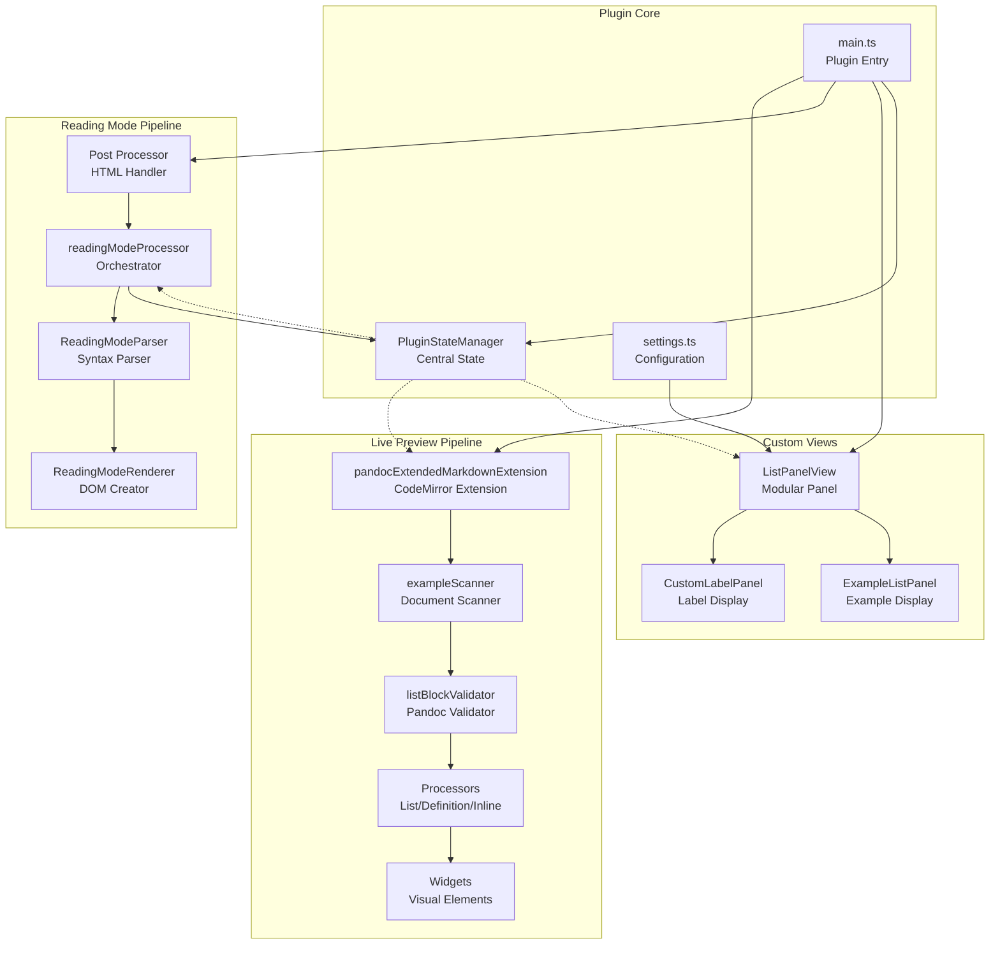
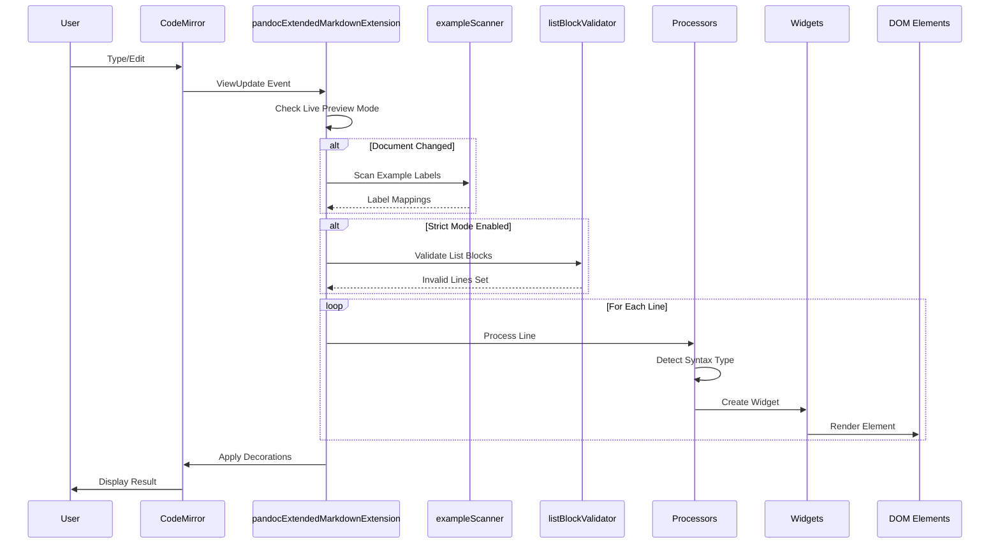
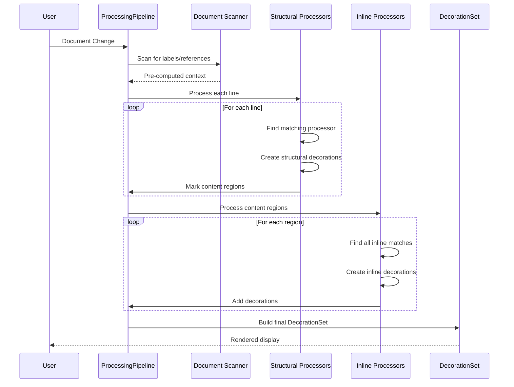
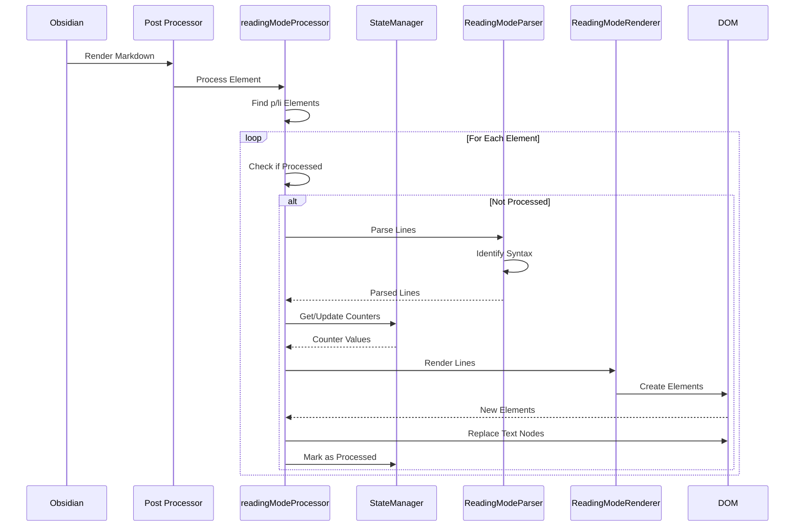
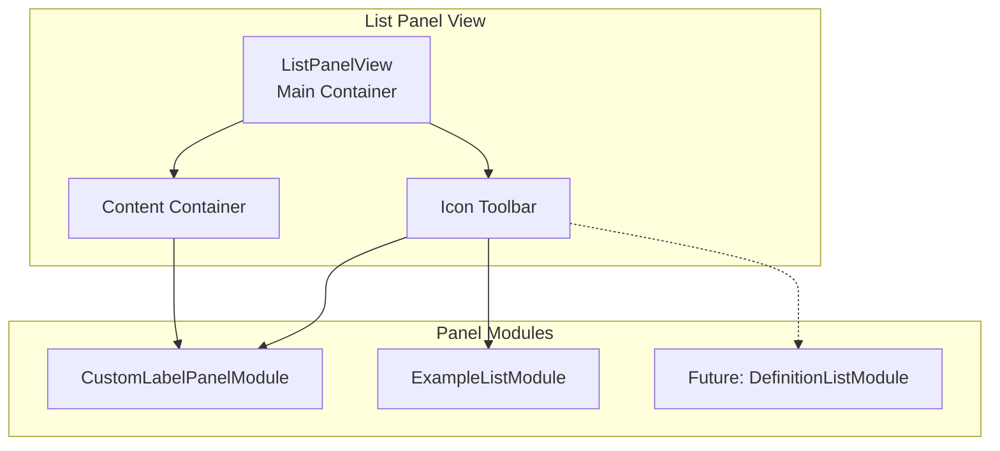
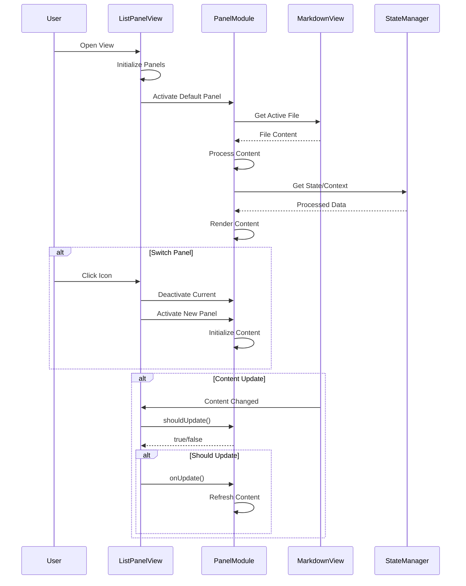
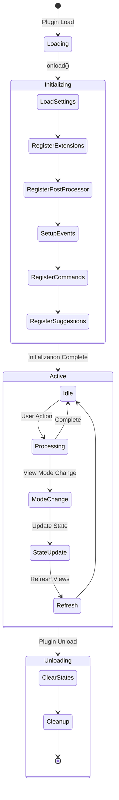
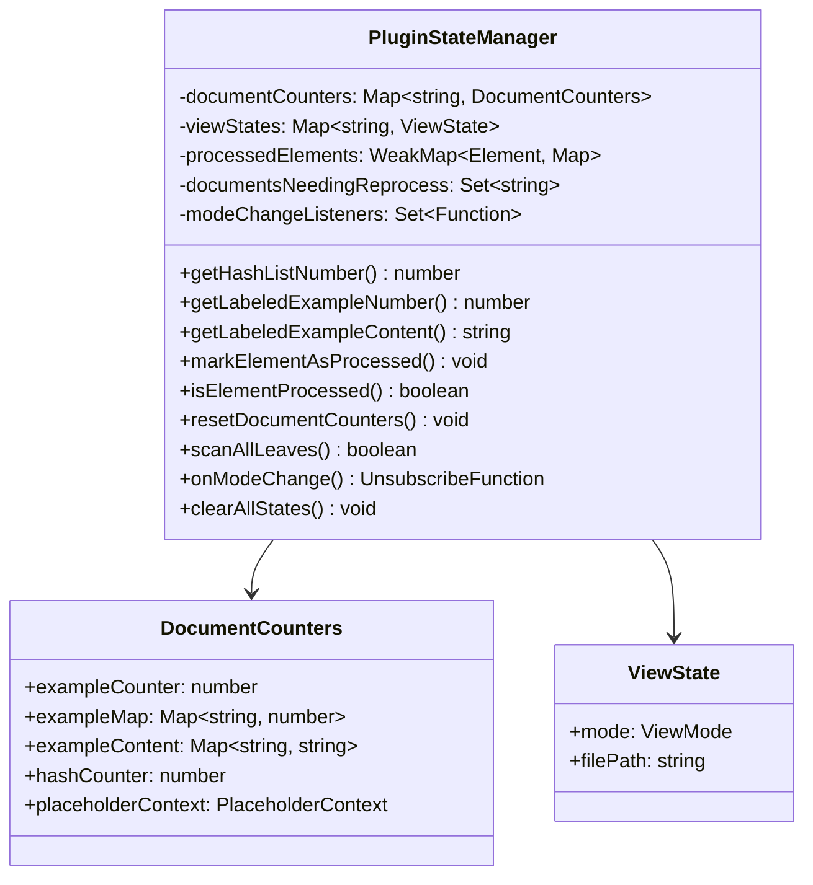
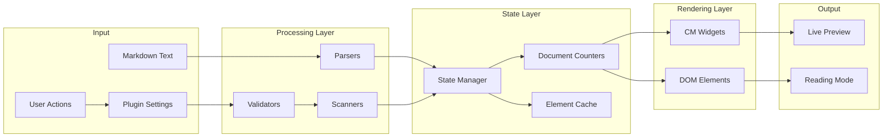

# Pandoc Extended Markdown Plugin Architecture

This document provides a comprehensive technical overview of the pandoc-extended-markdown-plugin architecture. It details the rendering pipelines, state management, and component interactions to facilitate debugging and feature development.

## Table of Contents

1. [Project Structure](#project-structure)
2. [Architecture Overview](#architecture-overview)
3. [Live Preview Rendering Pipeline](#live-preview-rendering-pipeline)
4. [Reading Mode Rendering Pipeline](#reading-mode-rendering-pipeline)
5. [Plugin Lifecycle & State Management](#plugin-lifecycle--state-management)
6. [Data Flow Diagrams](#data-flow-diagrams)
7. [Component Responsibilities](#component-responsibilities)
8. [Architectural Protocols](#development-guidelines)

## Project Structure

```
pandoc-lists-plugin/
├── src/                                   # Source code directory
│   ├── main.ts                           # Plugin entry point, manages mode detection and state
│   ├── settings.ts                       # Settings interface and settings tab implementation
│   ├── pandocValidator.ts                # Validates and formats lists to Pandoc standards
│   ├── listAutocompletion.ts             # Handles Enter/Tab/Shift-Tab key bindings for lists
│   ├── exampleReferenceSuggest.ts       # Autocomplete suggestion system for (@references)
│   ├── customLabelReferenceSuggest.ts    # Autocomplete suggestions for {::references} with rendered preview
│   ├── constants.ts                      # Centralized constants (includes PANEL_SETTINGS)
│   ├── patterns.ts                       # Optimized regex patterns with caching
│   ├── state/                            # State management architecture
│   │   └── pluginStateManager.ts        # Unified state manager for all plugin state
│   ├── decorations/                      # CodeMirror decorations for live preview
│   │   ├── pandocExtendedMarkdownExtension.ts # Main orchestrator for live preview rendering
│   │   ├── pipeline/                     # Two-phase processing pipeline (NEW)
│   │   │   ├── ProcessingPipeline.ts    # Main pipeline orchestrator
│   │   │   ├── types.ts                 # Pipeline interfaces and types
│   │   │   ├── structural/              # Phase 1: Structural processors
│   │   │   │   ├── HashListProcessor.ts # Hash list (#.) processor
│   │   │   │   ├── FancyListProcessor.ts # Fancy list (A., i., etc.) processor
│   │   │   │   ├── ExampleListProcessor.ts # Example list ((@)) processor
│   │   │   │   ├── CustomLabelProcessor.ts # Custom label list ({::}) processor
│   │   │   │   ├── DefinitionProcessor.ts # Definition list (:, ~) processor
│   │   │   │   └── index.ts             # Re-exports structural processors
│   │   │   └── inline/                   # Phase 2: Inline processors
│   │   │       ├── ExampleReferenceProcessor.ts # Process (@references)
│   │   │       ├── CustomLabelReferenceProcessor.ts # Process {::references}
│   │   │       ├── SuperscriptProcessor.ts # Process superscripts (^)
│   │   │       ├── SubscriptProcessor.ts # Process subscripts (~)
│   │   │       └── index.ts             # Re-exports inline processors
│   │   ├── widgets/                      # CodeMirror widget implementations
│   │   │   ├── listWidgets.ts           # Widgets for list markers (fancy, hash, example)
│   │   │   ├── definitionWidget.ts      # Widget for definition list bullets
│   │   │   ├── referenceWidget.ts       # Widget for example references
│   │   │   ├── formatWidgets.ts         # Widgets for super/subscripts
│   │   │   ├── customLabelWidget.ts     # Widget for custom label lists and references
│   │   │   └── index.ts                 # Re-exports all widgets
│   │   ├── processors/                   # Legacy decoration processing (will be removed soon)
│   │   │   ├── listProcessors.ts        # Process hash, fancy, and example lists
│   │   │   ├── definitionProcessor.ts   # Process definition lists, terms, and paragraphs
│   │   │   ├── inlineFormatProcessor.ts # Process inline formats (references, super/subscripts)
│   │   │   ├── customLabelProcessor.ts  # Process custom label lists and references
│   │   │   └── index.ts                 # Re-exports all processors
│   │   ├── validators/                   # Validation utilities
│   │   │   └── listBlockValidator.ts    # Validates list blocks for strict Pandoc mode
│   │   └── scanners/                     # Document scanning utilities
│   │       ├── exampleScanner.ts        # Scans for example labels and duplicates
│   │       └── customLabelScanner.ts    # Scans for custom labels and validates blocks
│   ├── parsers/                          # Parsing and processing logic
│   │   ├── readingModeParser.ts         # Parses markdown text, identifies Pandoc syntax
│   │   ├── fancyListParser.ts           # Parses fancy lists (A., B., i., ii., #.)
│   │   ├── exampleListParser.ts         # Parses example lists with (@label) syntax
│   │   ├── definitionListParser.ts      # Parses definition lists (: and ~ markers)
│   │   ├── superSubParser.ts            # Parses superscripts (^) and subscripts (~)
│   │   ├── customLabelListParser.ts     # Parses custom label lists with {::LABEL} syntax
│   │   └── readingModeProcessor.ts      # Thin orchestration layer for reading mode
│   ├── renderers/                        # Rendering logic (DOM creation)
│   │   └── readingModeRenderer.ts       # Creates DOM elements from parsed markdown
│   ├── types/                            # TypeScript type definitions
│   │   ├── processorConfig.ts           # Configuration injection interface
│   │   ├── listTypes.ts                 # List-related interfaces and types
│   │   ├── obsidian-extended.ts         # Type definitions for Obsidian's internal APIs
│   │   └── settingsTypes.ts             # Settings interface (includes panelOrder) and default settings
│   ├── views/                            # Custom Obsidian views
│   │   ├── ListPanelView.ts             # Main modular panel view with icon toolbar
│   │   └── panels/                      # Modular panel implementations
│   │       ├── PanelTypes.ts            # Interfaces for panel module system
│   │       ├── CustomLabelPanelModule.ts # Custom label list panel implementation
│   │       └── ExampleListPanelModule.ts # Example list panel implementation
│   ├── utils/                            # Utility functions
│   │   ├── errorHandler.ts              # Error handling utilities with error boundaries
│   │   ├── placeholderProcessor.ts      # Auto-numbering processor for (#placeholder) syntax
│   │   ├── listHelpers.ts               # List conversion utilities (roman numerals, letters)
│   │   ├── listMarkerDetector.ts        # Detects list types and determines next markers
│   │   ├── listRenumbering.ts           # Handles automatic list renumbering
│   │   ├── mathRenderer.ts              # Math LaTeX to Unicode rendering utilities
│   │   ├── customLabelExtractor.ts      # Extracts and processes custom labels from markdown
│   │   ├── exampleListExtractor.ts      # Extracts example lists from markdown content
│   │   └── views/                       # View-specific utilities
│   │       ├── contentTruncator.ts      # Content truncation with math awareness
│   │       ├── viewInteractions.ts      # UI interaction handlers for panel views
│   │       ├── hoverPopovers.ts         # Reusable hover popover utilities
│   │       └── highlightUtils.ts        # Editor line highlighting functionality
├── __mocks__/                            # Jest mock implementations
│   ├── obsidian.ts                      # Mocks Obsidian API for testing
│   └── codemirror.ts                    # Mocks CodeMirror modules for testing
├── tests/                                # Test files
│   ├── pipeline/                         # Tests for new pipeline architecture (NEW)
│   │   ├── ProcessingPipeline.spec.ts   # Tests for main pipeline orchestrator
│   │   ├── crossReferenceIntegration.spec.ts # Integration tests for cross-references
│   │   ├── structural/                  # Tests for structural processors
│   │   │   ├── HashListProcessor.spec.ts
│   │   │   ├── FancyListProcessor.spec.ts
│   │   │   ├── ExampleListProcessor.spec.ts
│   │   │   ├── CustomLabelProcessor.spec.ts
│   │   │   └── DefinitionProcessor.spec.ts
│   │   └── inline/                       # Tests for inline processors
│   │       ├── ExampleReferenceProcessor.spec.ts
│   │       ├── CustomLabelReferenceProcessor.spec.ts
│   │       ├── SuperscriptProcessor.spec.ts
│   │       └── SubscriptProcessor.spec.ts
│   ├── customLabelAutocompletion.spec.ts # Tests for custom label auto-completion
│   ├── customLabelAutoNumbering.spec.ts  # Tests for custom label auto-numbering
│   ├── customLabelList.spec.ts          # Tests for custom label list functionality
│   ├── customLabelMultiLine.spec.ts     # Tests for multi-line custom label blocks
│   ├── customLabelNestedWidget.spec.ts  # Tests for nested custom label widgets
│   ├── customLabelPlaceholder.spec.ts   # Tests for placeholder numbering and context
│   ├── customLabelReadingMode.spec.ts   # Tests for custom labels in reading mode
│   ├── customLabelSuggestion.spec.ts    # Tests for custom label reference suggestions
│   ├── customLabelView.spec.ts          # Tests for custom label sidebar view
│   ├── definitionListParser.spec.ts     # Tests for definition list parsing
│   ├── exampleListParser.spec.ts        # Tests for example list parsing
│   ├── fancyListParser.spec.ts          # Tests for fancy list parsing
│   ├── listAutocompletion.spec.ts       # Tests for list auto-completion
│   ├── listIndentation.spec.ts          # Tests for list indentation handling
│   └── toggleDefinitionStyles.spec.ts   # Tests for definition style toggling
├── .github/                              # GitHub specific files
│   └── workflows/
│       └── release.yml                  # GitHub Actions workflow for automated releases
├── main.js                              # Compiled plugin code (build output)
├── manifest.json                         # Plugin metadata (id, name, version, minAppVersion)
├── versions.json                         # Version compatibility mapping for updates
├── styles.css                            # Main plugin styles for all list types
├── package.json                          # Node.js dependencies and scripts
├── tsconfig.json                         # TypeScript compiler configuration
├── jest.config.js                        # Jest testing framework configuration
├── esbuild.config.mjs                    # Build configuration for bundling the plugin
├── .gitignore                            # Specifies files to exclude from version control
├── LICENSE                               # MIT License file
├── README.md                             # User documentation
└── ARCHITECTURE.md                       # This technical documentation
```

## Architecture Overview

The plugin operates in two distinct rendering modes, each with its own pipeline:

1. **Live Preview Mode**: Real-time syntax transformation using CodeMirror 6 decorations
2. **Reading Mode**: Post-processing of rendered HTML using DOM manipulation

Both modes share a common state management system through `PluginStateManager`.

Additionally, the plugin provides a **List Panel View** - a modular sidebar panel with an icon toolbar that can display different types of list-related content. Currently supports:
- **Custom Label Panel**: Displays all custom label lists from the current document in an organized, interactive format (only available when "Custom Label List" setting is enabled)
- **Example List Panel**: Displays all example lists with their numbers, labels, and content in a three-column layout (always available)



## Live Preview Rendering Pipeline (Deprecated)

*The legacy live preview system transforms markdown syntax in real-time as users type, using CodeMirror 6's decoration system to overlay visual elements without modifying the underlying text. It will be removed from the repo soon. It will replaced by the new Two-Phase Processing Pipeline*

### Overview
The live preview system transforms markdown syntax in real-time as users type, using CodeMirror 6's decoration system to overlay visual elements without modifying the underlying text.

### Detailed Flow



### Key Components

#### 1. pandocExtendedMarkdownExtension (Orchestrator)
- **Location**: `src/decorations/pandocExtendedMarkdownExtension.ts`
- **Role**: Main coordinator for live preview rendering
- **Responsibilities**:
  - Detects live preview mode state
  - Triggers document scanning when content changes
  - Manages decoration building and application
  - Handles cursor-aware rendering (hides widgets when cursor is inside)

#### 2. Document Scanners
- **exampleScanner** (`src/decorations/scanners/exampleScanner.ts`): Pre-processes example labels for consistent numbering
- **customLabelScanner** (`src/decorations/scanners/customLabelScanner.ts`): 
  - Scans custom labels with placeholder support
  - Validates block structure in strict mode
  - Smart reset detection: only resets PlaceholderContext when placeholder order changes
  - Two-pass scanning: detects placeholders first, then processes labels
  - Duplicate detection: tracks duplicate labels and their first occurrence
- **Output**:
  ```typescript
  interface ExampleScanResult {
    exampleLabels: Map<string, number>        // label -> number
    exampleContent: Map<string, string>       // label -> content
    exampleLineNumbers: Map<number, number>   // line -> example number
    duplicateLabels: Map<string, number>      // duplicate -> first line
    duplicateLabelContent: Map<string, string> // duplicate -> original content
  }
  
  interface CustomLabelScanResult {
    customLabels: Map<string, string>         // processed label -> content
    rawToProcessed: Map<string, string>       // raw label -> processed label
    duplicateLabels: Set<string>              // labels that appear more than once
    duplicateLineInfo?: Map<string, { firstLine: number; firstContent: string }> // duplicate label -> first occurrence info
    placeholderContext: PlaceholderContext    // context for auto-numbering
  }
  ```

#### 3. Processors
Transform markdown syntax into decorations:
- **List Processors**: Hash lists (#.), fancy lists (A., i.), example lists ((@))
- **Definition Processors**: Terms, items (~/:), indented paragraphs
- **Inline Processors**: References, superscripts, subscripts
- **Custom Label Processor**: Custom label lists ({::LABEL}) with:
  - Auto-numbering support for (#placeholder) syntax
  - Three-level display system based on cursor position
  - Selective placeholder expansion (only expands placeholder under cursor)

#### 4. Widgets
Visual representations that replace markdown syntax:
- **HashListMarkerWidget**: Auto-numbered list items
- **FancyListMarkerWidget**: Styled alphabetic/roman markers
- **ExampleListMarkerWidget**: Numbered examples with tooltips
- **DefinitionBulletWidget**: Bullet points for definitions
- **SuperscriptWidget/SubscriptWidget**: Formatted text elements
- **CustomLabelMarkerWidget**: Custom label list markers
- **CustomLabelReferenceWidget**: Custom label references with tooltips
- **CustomLabelPartialWidget**: Partial rendering for bracket/parenthesis parts
- **CustomLabelPlaceholderWidget**: Styled placeholder numbers with dotted underline
- **CustomLabelProcessedWidget**: Processed form display for semi-expanded state
- **CustomLabelInlineNumberWidget**: Atomic inline number replacements for selective expansion
- **DuplicateCustomLabelWidget**: Duplicate custom label warning with error styling
- **DuplicateExampleLabelWidget**: Duplicate example label warning with error styling

### Trigger Events
- Document changes
- Viewport changes (scrolling)
- Selection changes (cursor movement)
- Live preview mode toggle


## Two-Phase Processing Pipeline (NEW)

### Overview
Starting in v1.4.0, the plugin implements a new two-phase processing pipeline that cleanly separates structural (block-level) processing from inline content processing. This architecture eliminates code duplication and makes the plugin more maintainable and extensible.

### Architecture Benefits

1. **Clean Separation of Concerns**: Structural processors handle list markers and block structures, while inline processors handle references and formatting
2. **No Code Duplication**: Inline processors automatically work across all list types
3. **Easy Extensibility**: New syntax types can be added by creating and registering new processors
4. **Consistent Processing**: All content regions are processed by the same inline processors
5. **Better Testing**: Each processor can be tested independently

### Pipeline Phases

#### Phase 1: Structural Processing
Identifies and decorates block-level structures (list markers, definition terms, etc.)

```typescript
interface StructuralProcessor {
    name: string;
    priority: number; // Lower numbers process first
    canProcess(line: Line, context: ProcessingContext): boolean;
    process(line: Line, context: ProcessingContext): StructuralResult;
}
```

**Registered Structural Processors:**
- `HashListProcessor` (priority: 10) - Handles `#.` auto-numbered lists
- `FancyListProcessor` (priority: 20) - Handles `A.`, `i.`, `(a)` style lists
- `ExampleListProcessor` (priority: 30) - Handles `(@label)` example lists
- `CustomLabelProcessor` (priority: 15) - Handles `{::LABEL}` custom label lists
- `DefinitionProcessor` (priority: 20) - Handles `:` and `~` definition lists

#### Phase 2: Inline Processing
Processes content within marked regions for references and inline formatting

```typescript
interface InlineProcessor {
    name: string;
    priority: number;
    supportedRegions: Set<string>; // Which content types to process
    findMatches(text: string, region: ContentRegion, context: ProcessingContext): InlineMatch[];
    createDecoration(match: InlineMatch, context: ProcessingContext): Decoration;
}
```

**Registered Inline Processors:**
- `ExampleReferenceProcessor` (priority: 10) - Processes `(@references)`
- `CustomLabelReferenceProcessor` (priority: 10) - Processes `{::references}`
- `SuperscriptProcessor` (priority: 20) - Processes `^superscripts^`
- `SubscriptProcessor` (priority: 20) - Processes `~subscripts~`

### Processing Flow



### Adding New Syntax Support

To add a new cross-reference or inline format:

1. **Create the processor**:
```typescript
class NewReferenceProcessor implements InlineProcessor {
    name = 'new-reference';
    priority = 15;
    supportedRegions = new Set(['list-content', 'definition-content']);
    
    findMatches(text: string, region: ContentRegion, context: ProcessingContext) {
        // Find your syntax pattern
    }
    
    createDecoration(match: InlineMatch, context: ProcessingContext) {
        // Create widget or mark decoration
    }
}
```

2. **Register it**:
```typescript
pipeline.registerInlineProcessor(new NewReferenceProcessor());
```

That's it! The new syntax will automatically work in all list types and content regions.

## Reading Mode Rendering Pipeline

### Overview
The reading mode system post-processes HTML after Obsidian's markdown renderer, transforming Pandoc syntax that wasn't handled by the default parser.

### Detailed Flow



### Key Components

#### 1. readingModeProcessor (Orchestrator)
- **Location**: `src/parsers/readingModeProcessor.ts`
- **Role**: Coordinates parsing, state management, and rendering
- **Process**:
  1. Selects paragraph and list item elements
  2. Validates against markdown source
  3. Prevents duplicate processing
  4. Manages render context creation

#### 2. ReadingModeParser
- **Location**: `src/parsers/readingModeParser.ts`
- **Purpose**: Identifies and parses Pandoc syntax
- **Capabilities**:
  - Line-by-line parsing with context awareness
  - Multiple syntax type detection
  - Metadata extraction for each syntax type

#### 3. Specialized Parsers
Each parser handles specific syntax patterns:
- **fancyListParser**: Alphabetic and roman numeral lists
- **exampleListParser**: Example lists with labels
- **definitionListParser**: Definition terms and items
- **superSubParser**: Superscript and subscript formatting
- **customLabelListParser**: 
  - Custom label lists with {::LABEL} syntax
  - Two-pass processing: scans all labels first to build context, then processes elements
  - Handles multi-placeholder references like P(#a),(#b)

#### 4. ReadingModeRenderer
- **Location**: `src/renderers/readingModeRenderer.ts`
- **Purpose**: Creates DOM elements from parsed data
- **Features**:
  - Maintains line breaks and formatting
  - Adds tooltips for references
  - Handles nested markdown in definitions

## List Panel View

### Overview
The List Panel View provides a modular, extensible sidebar panel system for displaying various list-related content. It features an icon toolbar for switching between different panel modules and is designed to accommodate future expansion with additional list types. Panels can be conditionally registered based on plugin settings. The order of panels in the icon toolbar can be customized through the plugin settings.

### Architecture

#### Modular Design
The view follows a plugin architecture pattern:

```typescript
interface PanelModule {
    id: string;
    displayName: string;
    icon: string;  // SVG icon content
    isActive: boolean;
    
    onActivate(containerEl: HTMLElement, activeView: MarkdownView | null): void;
    onDeactivate(): void;
    onUpdate(activeView: MarkdownView | null): void;
    shouldUpdate(): boolean;
    destroy(): void;
}
```

#### Component Structure



### Adding New Panel Modules

To add a new panel module:

1. **Create Module Class**: Implement `PanelModule` interface
   ```typescript
   export class ExampleListPanelModule implements PanelModule {
       id = 'example-lists';
       displayName = 'Example Lists';
       icon = ICONS.EXAMPLE_LIST_SVG;
       // ... implement required methods
   }
   ```

2. **Register in ListPanelView**: Add to `initializePanels()`
   ```typescript
   private initializePanels(): void {
       // Register panel conditionally if needed
       const exampleListModule = new ExampleListPanelModule(this.plugin);
       availablePanels.push({
           id: exampleListModule.id,
           displayName: exampleListModule.displayName,
           icon: exampleListModule.icon,
           module: exampleListModule
       });
       
       // Panels are sorted according to user-configured order
   }
   ```

3. **Module Lifecycle**:
   - `onActivate()`: Called when user clicks the module's icon
   - `onUpdate()`: Called when document changes or view updates
   - `onDeactivate()`: Called when switching to another module
   - `destroy()`: Cleanup when view closes

### Implementation Example: Custom Label Panel

The Custom Label Panel displays all custom label lists (`{::LABEL}` syntax) from the active markdown document.

### Features
- **Two-column layout**: Displays processed labels and their rendered content
- **Smart truncation**: 
  - Labels limited to 6 characters
  - Content limited to 51 rendered characters (math-aware)
  - Math formulas are truncated based on their rendered length, not raw LaTeX length
  - Preserves valid LaTeX syntax when truncating (no trailing spaces before $)
- **Interactive elements**:
  - Label click: Copies raw label syntax to clipboard
  - Content click: Navigates to label position in editor with visual highlight
  - Hover previews: Shows full content with rendered math (only when truncated)
- **Label processing**: Replaces placeholders (#a) with numbers, shows processed form
- **Content rendering**: Displays fully rendered text with processed references and math
- **Auto-refresh**: Updates when switching files or editing content
- **Error boundaries**: Safe operation with fallback for errors

### View Interaction Flow



### Key Implementation Details

- **`extractCustomLabels()`**: Parses document for custom label syntax and processes placeholders (uses `customLabelExtractor.ts`)
- **`renderLabels()`**: Creates DOM structure with interactive elements
- **`updateContent()`**: Updates panel when active file changes
- **Availability**: Only registered when `moreExtendedSyntax` setting is enabled
- **Truncation utilities** (in `contentTruncator.ts`):
  - `truncateLabel()`: Truncates labels to 6 characters
  - `truncateContent()`: Simple truncation to 51 characters
  - `truncateContentWithRendering()`: Smart truncation considering rendered math length
- **Math rendering utilities** (in `mathRenderer.ts`):
  - `renderMathToText()`: Converts LaTeX to Unicode
  - `tokenizeMath()`: Tokenizes LaTeX content
  - `truncateMathContent()`: Intelligently truncates LaTeX
- **Interaction handlers** (in `viewInteractions.ts`):
  - `setupLabelClickHandler()`: Handles label copying
  - `setupContentClickHandler()`: Handles navigation
  - `setupHoverPreview()`: Shows popover for truncated content

## Plugin Lifecycle & State Management

### Lifecycle Sequence



### PluginStateManager Architecture

The central state management system maintains consistency across all plugin operations:



### State Management Features

#### Document-Specific State
- Isolated counters per document
- Label-to-number mappings for cross-references
- Content caching for tooltips
- Reprocessing flags for efficient updates
- PlaceholderContext persistence across mode switches

#### View Mode Tracking
- Per-leaf mode detection (reading/live/source)
- Mode transition detection
- Event notification system
- Batch processing optimization

#### Memory Management
- WeakMap for automatic garbage collection
- Explicit cleanup on unload
- Lazy initialization of counters
- Strategic state clearing on mode changes

## Data Flow Diagrams

### Overall Data Flow



## Component Responsibilities

### Core Components

| Component | Primary Responsibility | Key Interfaces |
|-----------|----------------------|----------------|
| `main.ts` | Plugin lifecycle management | `onload()`, `onunload()`, event registration |
| `pluginStateManager` | Centralized state coordination | Counter management, mode tracking, event dispatch |
| `settings.ts` | User configuration | Settings UI, panel order configuration, preference persistence |
| `pandocValidator.ts` | Pandoc compliance validation | Format checking, auto-formatting |
| `listAutocompletion.ts` | Smart list continuation | Enter/Tab/Shift-Tab key handling, uses utility modules |
| `ListPanelView.ts` | Modular sidebar panel system | Panel management, icon toolbar, content switching |
| `panels/PanelTypes.ts` | Panel module interfaces | Type definitions for extensible panel system |
| `panels/CustomLabelPanelModule.ts` | Custom label panel implementation | Label display, navigation, clipboard operations |
| `panels/ExampleListPanelModule.ts` | Example list panel implementation | Three-column display with numbers, labels, and content |


### Live Preview Components

| Component | Responsibility | Input | Output |
|-----------|---------------|-------|--------|
| `pandocExtendedMarkdownExtension` | Orchestration | ViewUpdate events | Decorations |
| `ProcessingPipeline` | Two-phase processing coordination | View, settings | DecorationSet |
| `structural/*` | Phase 1: Block-level processing | Line, context | Structural decorations |
| `inline/*` | Phase 2: Inline content processing | Content regions | Inline decorations |
| `exampleScanner` | Label preprocessing | Document text | Label mappings |
| `listBlockValidator` | Strict mode validation | Document lines | Invalid line set |
| `processors/*` (legacy) | Syntax processing | Line text, context | Decoration specs |
| `widgets/*` | Visual rendering | Widget data | DOM elements |

### Reading Mode Components

| Component | Responsibility | Input | Output |
|-----------|---------------|-------|--------|
| `readingModeProcessor` | Orchestration | HTML elements | Modified DOM |
| `ReadingModeParser` | Syntax identification | Text content | Parsed lines |
| `*Parser` (specialized) | Pattern matching | Line text | Structured data |
| `ReadingModeRenderer` | DOM generation | Parsed data | HTML elements |