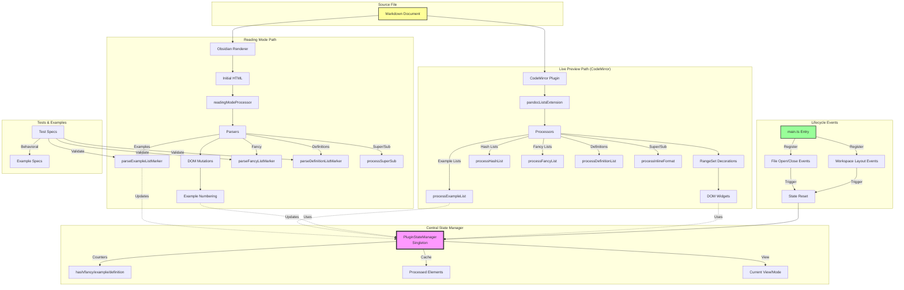

# Test Labeled Examples Numbering

## Multiple labeled examples (should increment)

(@first) This is the first example
(@second) This is the second example  
(@third) This is the third example

## Mixed labeled and unlabeled

(@alpha) Example one
(@) Unlabeled example
(@beta) Example three
(@) Another unlabeled 
(@gamma) Example five
(@bbb) bbb 
(@) aaa 

## References

See examples (@first), (@second), and (@third)
Also see (@alpha), (@beta), and (@gamma)

